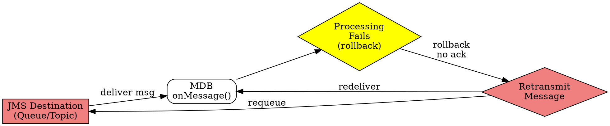

# Poison Message

## The Problem
When a Message-Driven Bean fails to process a message (throws a system exception or calls `setRollbackOnly()`), the transaction rolls back and the JMS destination doesn't receive an acknowledgment. The destination then retransmits the same message, causing the MDB to fail again — creating an infinite loop that wastes CPU and memory.

## Core Idea
A poison message is a message that continuously fails processing and gets repeatedly retransmitted by the JMS destination. It creates an infinite retry loop that can drain system resources if not handled properly.

## How It Works
1. MDB receives a message and begins processing (within a container-managed transaction)
2. Processing fails — MDB throws a system exception OR calls `MessageDrivenContext.setRollbackOnly()`
3. Transaction rolls back → message acknowledgment is NOT sent to JMS destination
4. JMS destination detects no ack → retransmits the same message to the container
5. Container assigns MDB instance → same failure occurs → another rollback
6. Loop continues indefinitely until manually stopped or a Dead Letter Queue (DLQ) intervenes

### Example Scenario (Stock Quote MDB)
- Message contains ticker symbol "INVALID"
- MDB cracks open message, doesn't find a valid stock
- MDB throws system exception or calls `setRollbackOnly()`
- Transaction rollback → message not acknowledged
- JMS retransmits "INVALID" → MDB fails again → infinite loop

## Visual Explanation

## Key Properties
- Caused by transaction rollback in MDB (system exception or `setRollbackOnly()`)
- MDB is stateless — doesn't remember that this message previously failed
- Infinite loop consumes CPU, memory, and JMS resources
- Solution: Dead Letter Queue (DLQ) after N retry attempts (configured in MOM)
- Also solved by catching exceptions and acknowledging the message (don't rollback)

## Connections
- Built from: [[message-driven-bean|MDB]] — poison messages occur in MDB message processing
- Built from: [[container-managed-transactions|CMT]] — rollback behavior is controlled by container-managed transactions
- Related: [[queue-partitioning|Queue Partitioning]] — separate queues reduce poison message impact
- Related: [[setrollbackonly|setRollbackOnly()]] — method that triggers rollback causing poison messages
- Contrasts with: [[session-bean|Session Bean]] — session beans don't process queued messages, so no poison messages

## Edge Cases & Gotchas
- MDB has no memory of prior failures — will retry the same message indefinitely
- Poison messages can cascade — one bad message can block a queue if consumers keep retrying
- `setRollbackOnly()` is the programmatic way to cause a poison message (besides throwing exceptions)
- Some MOMs have configurable "max retries" before moving message to DLQ
- Poison messages also occur with BMP entity beans that rollback transactions repeatedly

## Sources
- [[EJb4-summary|EJb4.md Source Summary]]
