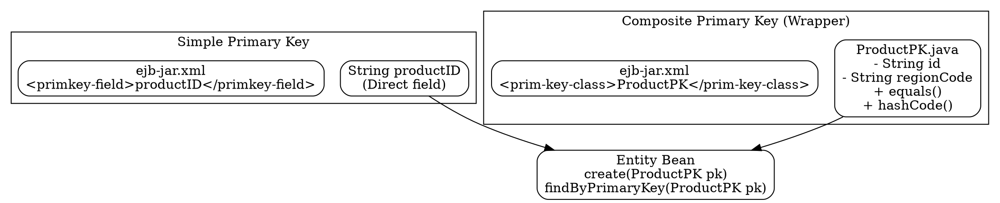

# Primary Key Class

## The Problem
A database table may have a simple primary key (single column like `productID`) or a composite primary key (multiple columns like `ID + RegionCode`). If a primary key changes from simple to composite, entity bean code that assumed a single String key would break. There needs to be a flexible way to represent primary keys in EJB.

## Core Idea
A Primary Key Class is a custom Java class that wraps one or more primary key fields. It is used as the return type of `ejbCreate()` and the parameter type for `findByPrimaryKey()`. Using a wrapper class makes the bean future-proof against schema changes.

## How It Works
1. **Option 1 (Direct Field):** Use a simple type like `String` or `int` as the primary key, declared in `ejb-jar.xml` via `<primkey-field>productID</primkey-field>`
2. **Option 2 (Wrapper Class):** Create a class like `ProductPK.java` that holds the key fields as instance variables
3. The wrapper class must implement `Serializable` and override `equals()` and `hashCode()` (so the container can compare keys)
4. If the database schema changes to a composite key, you just add fields to the wrapper class — bean code doesn't break
5. The container uses the primary key to identify entity bean instances in the pool

## Visual Explanation

## Key Properties
- Must be Serializable for EJB container to pass keys between JVMs
- Must override `equals()` and `hashCode()` for proper key comparison
- Wrapper class protects against database schema changes (composite key evolution)
- Used by `ejbCreate()`, `ejbPostCreate()`, and all finder methods
- Can be shared across beans that have the same key structure

## Connections
- Built from: [[entity-bean|Entity Bean]] — Primary key classes are used exclusively with entity beans
- Builds into: [[ejbcreate|ejbCreate()]] — create method returns the primary key type
- Builds into: [[finder-methods|Finder Methods]] — findByPrimaryKey uses the PK class
- Related: [[getprimarykey|getPrimaryKey()]] — runtime method to retrieve the current bean's primary key
- Contrasts with: [[direct-field-pk|Direct Field Primary Key]] — simpler but less flexible approach

## Edge Cases & Gotchas
- Forgetting to override `equals()` and `hashCode()` causes container to fail at finding beans by primary key
- Wrapper class must have a no-arg constructor (container instantiates it via reflection)
- Changing from simple to composite key requires updating `ejbPostCreate()` and home interface method signatures
- The PK class must be available in the EJB jar's classpath

## Sources
- [[EJb4-summary|EJb4.md Source Summary]]
