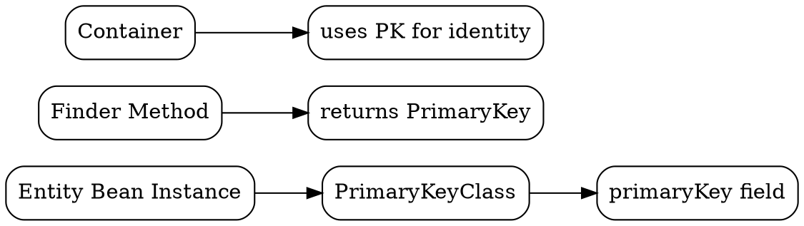

## The Problem
In databases, we need a way to uniquely identify each row/record. Without a unique identifier, we can't reliably update, delete, or reference specific records. Multiple records might have identical data but represent different entities.

## Core Idea
A primary key is a column (or set of columns) whose values uniquely identify each row in a database table. In EJB entity beans, the primary key is wrapped in a PrimaryKeyClass object that the container uses for identity management.

## How It Works
In relational databases:
1. **Uniqueness** — no two rows can have the same primary key value
2. **Non-null** — primary key cannot be NULL
3. **Immutable** — once set, primary key shouldn't change

In EJB Entity Beans:
1. **PrimaryKeyClass** — wrapper class implementing Serializable and optionally hashCode/equals
2. **getPrimaryKey()** — method to retrieve current entity's primary key
3. **Finder methods** — return primary keys to locate entities
4. **Container uses PK** — for pooling, identity, and relationship management

## Visual Explanation

## Key Properties
- **Unique identification** — each entity instance has distinct primary key
- **Serializable** — PrimaryKeyClass must implement java.io.Serializable
- **Simple or composite** — single field or multiple fields combined
- **Container-managed** — EJB container tracks entities by primary key

## Connections
- Built from: [[entity-bean|Entity Bean]] — entity beans use primary keys for identity
- Built from: [[entity-bean-identity|Entity Bean Identity]] — PK defines entity identity
- Builds into: [[finder-methods|Finder Methods]] — return primary keys
- Builds into: [[getprimarykey|getPrimaryKey()]] — method to retrieve PK
- Builds into: [[primary-key-class|Primary Key Class]] — wrapper class for PK
- Related: [[jdbc|JDBC]] — SQL uses primary keys for WHERE clauses

## Edge Cases & Gotchas
- **Composite keys** — need custom PrimaryKeyClass with proper equals() and hashCode()
- **Auto-generated keys** — database can generate (e.g., AUTO_INCREMENT), must sync to bean
- **Changing PK** — don't change primary key after creation; it breaks identity

## Sources
- [[ejb-source-summary|EJB Source Summary]]
- [[EJb4-summary|EJB4 Source Summary]]
