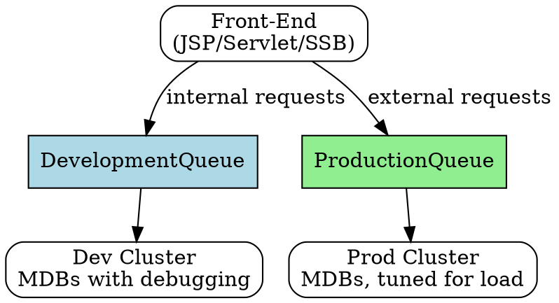

## The Problem
In a clustered environment, you may have development/test traffic and production traffic mixed together. Without separation, test messages could be processed by production clusters and vice versa. You need controlled load balancing where specific machines handle specific types of messages.

## Core Idea
Queue partitioning uses multiple JMS queues (e.g., DevelopmentQueue, ProductionQueue) to route different types of messages to different server clusters. Front-end components analyze the request source and place messages on the appropriate queue, controlling which cluster processes which traffic.

## How It Works
1. Set up multiple queues: `DevelopmentQueue` and `ProductionQueue`
2. Front-end (JSP/Servlet/Stateless Session Bean) checks request source (e.g., internal IP)
3. Message placed on `DevelopmentQueue` for internal test requests
4. Message placed on `ProductionQueue` for external real client requests
5. Back-end: Development cluster MDBs bound to `DevelopmentQueue`
6. Back-end: Production cluster MDBs bound to `ProductionQueue`
7. Each cluster can be tuned independently (size, debugging, behavior)

## Visual Explanation

## Key Properties
- Artificial way to achieve controlled load balancing in JMS systems
- Each cluster can be independently scaled based on its queue's load
- Development MDBs can include debugging statements; production MDBs optimized
- Pre-chooses which machines get which messages (before they reach the queue)
- Separates test and production traffic completely

## Connections
- Built from: [[message-driven-bean|MDB]] — MDBs consume from specific queues
- Built from: [[jms|JMS]] — uses JMS queues for message routing
- Related: [[poison-message|Poison Message]] — poisoning one queue doesn't affect the other
- Related: [[point-to-point-vs-pub-sub|PTP vs Pub/Sub]] — uses Point-to-Point (Queue) model
- Related: [[stateless-session-bean|Stateless Session Bean]] — can be the front-end that routes messages

## Edge Cases & Gotchas
- Requires front-end logic to classify and route messages (additional complexity)
- Queue names must be known at deployment time (configured in MDB deployment)
- If one queue gets all the traffic, that cluster may be overwhelmed while other is idle
- Not true dynamic load balancing — routing decision made before queue insertion

## Sources
- [[EJb4-summary|EJb4.md Source Summary]]
