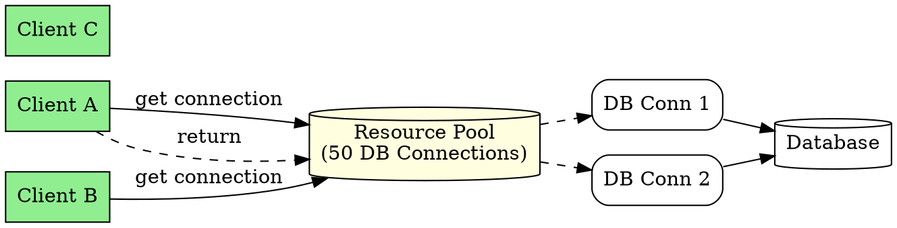

# Resource Pooling

## The Problem
Creating expensive resources like database connections, socket connections, or threads for each client request is inefficient. These resources take time to create and are limited. How can we reuse them efficiently?

## Core Idea
Resource pooling is the practice of maintaining a pool of ready-to-use resources (DB connections, sockets, threads) that are shared across clients. When a client needs a resource, it's taken from the pool; when done, it's returned for reuse.

## How It Works
1. **Pool creation**: Container pre-creates N connections (e.g., 50 DB connections)
2. **Client request**: Client needs DB access → gets connection from pool
3. **Usage**: Client uses connection for SQL operations
4. **Return**: Connection returned to pool (not closed/destroyed)
5. **Reuse**: Next client gets the same connection

JDBC drivers, JMS connection factories, and EJB instances all use pooling.

## Visual Explanation

## Key Properties
- **Expensive resources**: DB connections, sockets, threads are pooled
- **Container-managed**: EJB container manages resource pools
- **Enormous efficiency**: Same connection serves many clients
- **Shared by beans**: Entity beans, session beans share DB connection pool
- **Configurable**: Pool min/max size set in container config

## Connections
- Built from: [[instance-pooling|Instance Pooling]] — bean pooling is one type of resource pooling
- Builds into: [[jdbc|JDBC]] — JDBC connections are pooled
- Related: [[jms|JMS]] — JMS connections also pooled
- Related: [[ejb-container|EJB Container]] — container manages resource pools

## Edge Cases & Gotchas
- **Leaked connections**: Forgetting to close() returns connection to pool
- **Pool exhaustion**: All connections busy → clients wait or fail
- **Transaction scope**: Connection must remain same within transaction
- **Pool sizing**: Too small = wait; too large = waste memory

## Sources
- [[ejb6-summary|EJB6 Source Summary]]
