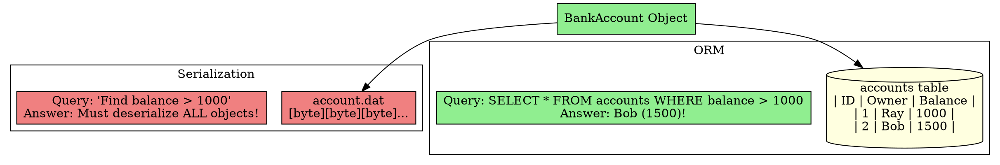

## The Problem
You need to save a Java object permanently. Should you serialize it to a byte stream, or map it to a relational database? What are the trade-offs?

## Core Idea

| Aspect | Serialization | ORM (Object-Relational Mapping) |
|--------|--------------|--------------------------------|
| **Storage format** | Byte blob (unreadable) | Relational table (readable) |
| **Querying** | Cannot query (must deserialize everything) | Full SQL queries (`SELECT * WHERE balance > 1000`) |
| **Debugging** | Hard (blob is unreadable) | Easy (inspect table with SQL) |
| **Tooling** | Built into Java (`Serializable`) | Requires ORM tool (Hibernate, TopLink, JDBC) |
| **Performance** | Fast for single objects | Better for large datasets (indexed queries) |
| **EJB Entity Beans** | Not used | Used (JDBC for BMP, container for CMP) |

## How It Works

**Serialization approach:**
```java
// Save
ObjectOutputStream oos = new ObjectOutputStream(new FileOutputStream("account.dat"));
oos.writeObject(bankAccount);
// Load
ObjectInputStream ois = new ObjectInputStream(new FileInputStream("account.dat"));
BankAccount account = (BankAccount) ois.readObject();
```

**ORM approach:**
```java
// Save (BMP style with JDBC)
PreparedStatement ps = conn.prepareStatement("INSERT INTO accounts (id, owner, balance) VALUES (?, ?, ?)");
ps.setString(1, account.getAccountID());
ps.setString(2, account.getOwnerName());
ps.setDouble(3, account.getBalance());
ps.executeUpdate();
```

## Visual Explanation



## Key Properties
- **ORM is superior for business data**: Queryability and debuggability win for enterprise apps
- **Serialization still useful**: For caching, session replication in clusters, simple use cases
- **Entity beans mandate ORM**: The EJB spec envisions ORM (not serialization) for entity beans
- **Modern ORM tools**: Hibernate (most popular), TopLink, JDO—reduce manual JDBC code

## Connections
- **Built from:** [[persistence-concepts|Persistence Concepts]], [[object-relational-mapping|Object-Relational Mapping]]
- **Builds into:** [[entity-bean|Entity Bean]] (uses ORM, not serialization)
- **Related:** [[jdbc|JDBC]] (API for ORM in BMP), [[bean-managed-persistence|BMP]]
- **Contrasts with:** Direct database access (no objects—just SQL)

## Edge Cases & Gotchas
- **Serialization version UID**: If you change the class, deserialization fails without `serialVersionUID`
- **ORM impedance mismatch**: Object model ≠ relational model (inheritance, collections are hard to map)
- **EJB 3.x uses JPA**: Java Persistence API—modern evolution of EJB entity beans + ORM

## Sources
- [[ejb5-summary|EJB5 Source Summary]]
