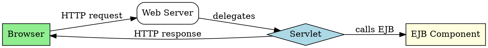

# Servlets

## The Problem
Web servers need to dynamically generate responses (HTML, JSON) based on client requests. Static HTML files aren't enough. How do we extend web server functionality to handle dynamic requests?

## Core Idea
Servlets are networked components that extend web server functionality. They are request/response-oriented: take HTTP requests from clients (browsers), process them, and issue responses back. Ideal for web tasks like rendering HTML interfaces.

## How It Works
1. **HTTP request**: Browser sends request to web server
2. **Servlet container**: Web server delegates to servlet (e.g., Tomcat)
3. **Lifecycle**: Container loads servlet class → calls `init()` (once) → `service()` (per request) → `destroy()` (once)
4. **Service method**: `doGet()`, `doPost()`, `doPut()`, `doDelete()` handle the request
5. **Filters**: Intercept requests before they reach the servlet for logging, authentication, compression
6. **Response generation**: Servlet writes HTML/JSON to response
7. **EJB integration**: Servlets can look up and call EJB components

Servlets differ from EJBs: no declarative transactions, simpler management by container.

## Visual Explanation

## Key Properties
- **Request/response**: Handles HTTP requests and generates responses
- **Web tier**: Part of presentation layer in J2EE
- **Lifecycle**: init() (once) → service() (per request) → destroy() (once)
- **Session management**: HttpSession API for maintaining user state across requests
- **Filters**: Servlet Filters for cross-cutting concerns (logging, auth, compression)
- **No EJB features**: Lacks declarative transactions, sophisticated container management
- **Simpler**: Better for simple request/response needs
- **Compiled to**: JSP scripts compile into servlets
- **J2EE standard**: Part of J2EE platform

## Connections
- Built from: [[java-platforms|Java Platforms]] — Servlets are part of J2EE
- Related: [[jsp|JSP]] — JSP compiles to servlets
- Builds into: [[ejb-container|EJB Container]] — servlets can call EJBs
- Related: [[jsp|JSP]] — JSP is alternative presentation technology
- Contrasts with: [[session-bean|Session Bean]] — servlets handle web, EJBs handle business logic

## Edge Cases & Gotchas
- **Thread safety**: Servlets are shared across requests, must be thread-safe — avoid instance variables
- **No transactions**: Use EJB if you need declarative transactions
- **Session management**: Servlets can use HTTP sessions but EJBs shouldn't
- **Filter ordering**: Filter execution order follows web.xml declaration order
- **async supported**: Servlet 3.0+ supports async processing for long-lived connections

## Sources
- [[ejb6-summary|EJB6 Source Summary]]
- [[java3-summary|Advanced Java Tutorial — Source Summary]] — servlet lifecycle, filters, CRUD, session management
