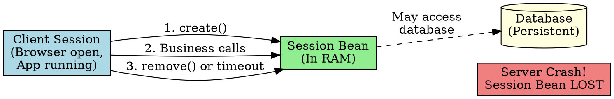

## The Problem
How long does a session bean live? Is it days? Years? Can it survive a server crash? Understanding bean lifetime is crucial for deciding what data to store in a session bean vs a database.

## Core Idea
Session beans are **short-lived, non-persistent objects**. Their lifetime is roughly the duration of the client session—when the client disconnects or times out, the container may destroy the bean. Session beans live in RAM and do NOT survive server crashes.

Contrast with Entity Beans which can live for months/years (persistent in database).

## How It Works
- **Client session starts**: Client calls `create()` on home interface → container creates bean
- **During session**: Bean serves the client (could be milliseconds or hours)
- **Client disconnects**: Bean is destroyed (or returned to pool for stateless)
- **Server crashes**: ALL session beans are lost (in-memory only)
- **Timeout**: If client is idle too long, container destroys bean

## Visual Explanation

## Key Properties
- **Non-persistent**: Session beans are NOT saved to permanent storage
- **Client-scoped**: Lifetime tied to client session (not permanent)
- **Container-managed**: Container decides exactly when to destroy
- **RAM-only**: Live in memory, not on disk

## Connections
- **Built from:** [[session-bean|Session Bean]], [[ejb-container|EJB Container]] (manages lifetime)
- **Builds into:** [[stateful-session-bean|Stateful Session Bean]] (dedicated lifetime), [[stateless-session-bean|Stateless Session Bean]] (pool-based lifetime)
- **Contrasts with:** [[entity-bean|Entity Bean]] (persistent, survives crashes, lives for years)
- **Related:** [[passivation|Passivation]] (stateful beans may be temporarily stored to disk)

## Edge Cases & Gotchas
- **Don't store critical data in session beans**: If server crashes, it's gone
- **Stateless beans may be destroyed after EVERY method call**: Don't expect data to persist between calls
- **Timeout values are configurable**: Deployer sets session timeout in vendor-specific config

## Sources
- [[ejb5-summary|EJB5 Source Summary]]
