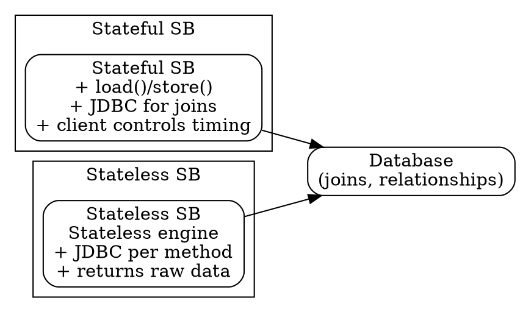

# Session Bean Relationships

## The Problem
Session beans don't have built-in persistence like entity beans, but they still need to perform database operations involving relationships (joins). Without a pattern, developers might misuse session beans for persistence when entity beans would be better.

## Core Idea
Session beans can perform persistence with relationships using JDBC (like BMP entity beans), but they lack identity and the container-managed lifecycle of entity beans. Stateful session beans can mimic entity beans but require manual coding; stateless session beans act as stateless persistence engines.

## How It Works

### Stateful Session Bean Approach
1. Use like an entity bean — expose load/store methods that client calls
2. Use JDBC to perform relationship queries (joins) manually
3. All BMP entity bean relationship best practices apply (JNDI lookups, FK↔stub conversion)
4. But: no container-managed identity, pooling behavior differs from entity beans

### Stateless Session Bean Approach
1. No state held — can't treat like an entity bean
2. Acts as a service — reads/writes rows, marshals data back to client per method call
3. Custom JDBC code for join queries must be written
4. Cleaner for simple operations but tedious for complex relationships

## Visual Explanation

## Key Properties
- Stateless SB: no identity, acts as stateless persistence service
- Stateful SB: can mimic entity bean, but all JDBC code is manual
- Not recommended for complex relationships — entity beans (especially CMP) are better
- Session beans use JDBC directly, not CMR (like CMP entity beans do)

## Connections
- Built from: [[session-bean|Session Bean]] — session beans can do persistence with relationships
- Built from: [[jdbc|JDBC]] — session beans use raw JDBC for relationship queries
- Contrasts with: [[entity-bean|Entity Bean]] — entity beans have built-in persistence; session beans don't
- Contrasts with: [[one-to-one-relationship|Entity Bean Relationships]] — entity beans handle relationships automatically (CMP) or with less boilerplate (BMP)
- Related: [[bean-managed-persistence|BMP]] — session bean relationship code is analogous to BMP

## Edge Cases & Gotchas
- Complex relationships in session beans = lots of manual JDBC code (not recommended)
- Stateful SB holding state across method calls can impact scalability (uses passivation)
- Stateless SB must marshal all data back per method call (no state retained)
- Entity beans (CMP) are the preferred choice for complex relationships

## Sources
- [[EJb4-summary|EJb4.md Source Summary]]
