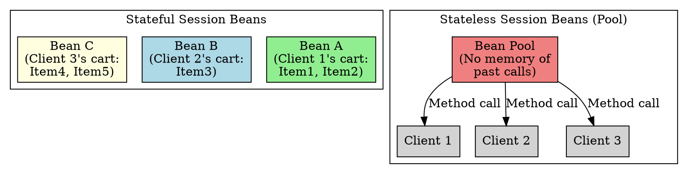

## The Problem
Business processes vary—some span multiple requests (like shopping carts), others are single-request (like credit card verification). One bean type can't efficiently handle both. What are the two subtypes and when to use each?

## Core Idea
Session beans have two subtypes based on how they handle conversational state:

- **Stateful Session Beans**: Maintain client-specific state across multiple method calls. Dedicated per client. Used for multi-step processes (shopping cart, wizard forms).
- **Stateless Session Beans**: Do not maintain conversational state. Each method call is independent. Pooled and shared across clients. Used for single-request tasks (calculations, verification).

## How It Works

| Aspect | Stateful | Stateless |
|--------|----------|-----------|
| **State** | Remembers across calls | Forgets after each call |
| **Client** | Dedicated (one bean per client) | Shared (pool, any client) |
| **Pooling** | No pooling (dedicated) | Highly pooled |
| **Examples** | Shopping cart, bank teller | Credit check, video compression |
| **Scalability** | Lower (RAM per client) | Higher (shared pool) |

## Visual Explanation

## Key Properties
- **Conversation**: Stateful = multi-method conversation; Stateless = single method
- **Stateful uses `ejbActivate()`/`ejbPassivate()`**:-Stateful beans can be passivated to disk
- **Stateless has no activation/passivation**: No state to save
- **Declared in deployment descriptor**: `<session-type>Stateful</session-type>` or `Stateless`

## Connections
- **Built from:** [[session-bean|Session Bean]] (parent concept)
- **Builds into:** [[stateful-session-bean|Stateful Session Bean]], [[stateless-session-bean|Stateless Session Bean]]
- **Related:** [[passivation|Passivation]], [[instance-pooling|Instance Pooling]]
- **Contrasts with:** [[entity-bean|Entity Bean]] (persistent data, not process)

## Edge Cases & Gotchas
- **Stateless can have instance variables**: Just not client-specific state (e.g., a shared DB connection factory is fine)
- **Switching types**: Change `<session-type>` in XML—no code changes needed (declarative)
- **Stateless for Web Services**: Since EJB 2.1, stateless beans can expose Web Service endpoints

## Sources
- [[ejb5-summary|EJB5 Source Summary]]
