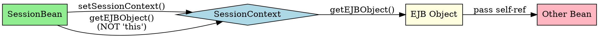

# SessionContext

## The Problem
A session bean needs to interact with the container (get security info, check rollbacks, get a reference to its own EJB object). How does the bean access these container-provided services?

## Core Idea
SessionContext is the EJB context specific to session beans. It extends EJBContext and provides `getEJBObject()` and `getEJBLocalObject()` methods, which beans use to get a reference to themselves (never use `this` keyword in EJB).

## How It Works
1. **setSessionContext()**: Container calls this to inject the context
2. **getEJBObject()**: Returns reference to the bean's EJB object (remote)
3. **getEJBLocalObject()**: Returns reference to the bean's local EJB object
4. **Why not `this`?**: `this` is the raw bean; clients call via EJB object proxy
5. **Usage**: Pass self-reference to other beans via `getEJBObject()`

## Visual Explanation

## Key Properties
- **Extends EJBContext**: Inherits `getCallerPrincipal()`, `setRollbackOnly()`, etc.
- **Injected by container**: Via `setSessionContext()` callback
- **`getEJBObject()`**: For remote interfaces
- **`getEJBLocalObject()`**: For local interfaces
- **Never use `this`**: Bean must use EJB object for self-reference

## Connections
- Built from: [[ejb-context|EJB Context]] — SessionContext extends EJBContext
- Related: [[session-bean|Session Bean]] — SessionContext is for session beans
- Contrasts with: [[entity-context|Entity Context]] — entity beans have different context
- Related: [[why-bean-doesnt-implement-interface|Why Bean Doesn't Implement Interface]] — `this` danger
- Builds into: [[business-interface-pattern|Business Interface Pattern]] — context used in pattern

## Edge Cases & Gotchas
- **`this` danger**: Passing `this` bypasses container services
- **Null check**: Context may be null before `setSessionContext()` called
- **Runtime only**: Context not available during `new` (only after container injects)
- **Method restrictions**: Can't call `getEJBObject()` in `ejbCreate()` (EJB object not associated yet)

## Sources
- [[ejb6-summary|EJB6 Source Summary]]
