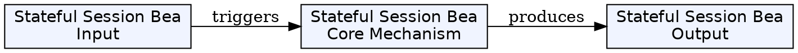
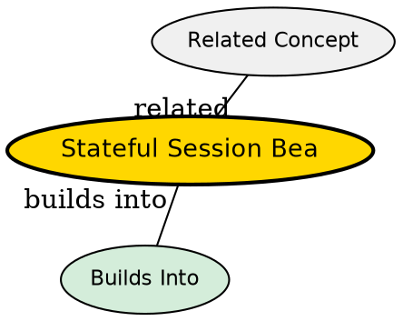

## The Problem

How do you model business processes that span multiple method requests and require the server to remember client state across invocations?

## Core Idea

A stateful session bean is a session bean designed to service business processes that span multiple method requests or transactions. It retains state on behalf of an individual client between method calls.

## How It Works

- Each client gets their own dedicated bean instance
- State is retained across method invocations for the same client
- Container can passivate (serialize to disk) instances to conserve memory when limits are reached
- Container can activate (restore to memory) passivated instances when client makes a request
- Dedicated to one client for the entire session--no instance pooling

## Key Properties

- Retains conversational state
- One bean per client
- Supports passivation/activation for memory management
- No instance pooling (unlike stateless)
- Examples: shopping carts, banking transactions across multiple steps

## Visual Explanation

## Semantic Network

## Connections

- Built from: [[session-bean|Session Bean]]
- Builds into: [[passivation|Passivation]], [[activation|Activation]]
- Contrasts with: [[stateless-session-bean|Stateless Session Bean]], [[message-driven-bean|Message-Driven Bean]]
- Related: [[ejbpassivate|ejbPassivate()]], [[ejbactivate|ejbActivate()]], [[session-bean-relationships|Session Bean Relationships]]

## Edge Cases & Gotchas

- Heavy on memory--can cause scalability issues with many concurrent users
- Container may passivate even if you don't explicitly request it
- State lost if client times out or container crashes