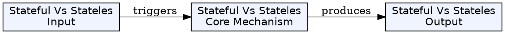
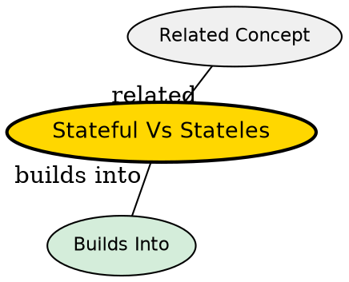

## Overview

Session beans are business process objects in EJB. They come in two flavors--stateful and stateless--each designed for different types of conversations with clients.

## Comparison

| Feature                  | Stateful Session Bean                                  | Stateless Session Bean                               |
| ------------------------ | ------------------------------------------------------ | ---------------------------------------------------- |
| **Conversational State** | Retained across multiple method calls                  | None retained between calls                          |
| **Client Relationship**  | Dedicated one-to-one bean per client                   | Shared pool, any instance can serve any client       |
| **Lifetime**             | Matches client session                                 | Single method call                                   |
| **Memory Management**    | Passivation/Activation for memory savings              | No passivation needed                                |
| **Instance Pooling**     | Not pooled (each is unique)                            | Pooled and reused                                    |
| **Scalability**          | Heavy, limited scalability                             | Lightweight, highly scalable                         |
| **Use Cases**            | Shopping carts, multi-step forms, banking transactions | Credit card verification, calculations, web services |

## When to Use

### Use Stateful When:

- Business process spans multiple method invocations
- Must remember client data across requests
- Examples: e-commerce shopping cart, multi-step loan application

### Use Stateless When:

- Each request is independent
- Need high scalability
- Examples: rate calculation, data validation, report generation

## Key Insight

The fundamental difference is whether the conversation spans one request or multiple requests. Stateless beans are like stateless HTTP--they don't remember previous interactions. Stateful beans maintain the conversation state, like a logged-in user's session.

## Visual Explanation

## Semantic Network

## Connections

- [[stateful-session-bean|Stateful Session Bean]]
- [[stateless-session-bean|Stateless Session Bean]]
- [[session-bean|Session Bean]]
- [[passivation|Passivation]]
- [[activation|Activation]]
- [[instance-pooling|Instance Pooling]]