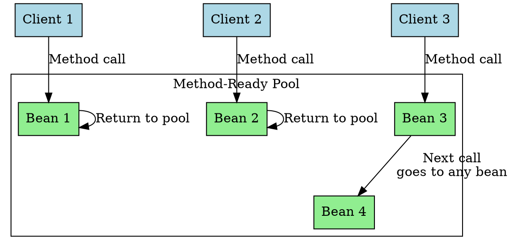

## The Problem
If 1000 clients want to use a stateless session bean, should the container create 1000 bean instances? That wastes RAM. Since stateless beans don't maintain client-specific state, can't we reuse them?

## Core Idea
Stateless session beans are pooled. The container maintains a "Method-Ready Pool" of equivalent bean instances. Any client can use any instance—since there's no conversational state, it doesn't matter which instance serves which client. After each method call, the bean returns to the pool for reuse.

## How It Works
1. **Container pre-creates pool**: At startup (or when needed), container creates N bean instances (`Class.newInstance()`, `setSessionContext()`, `ejbCreate()`)
2. **Client calls method**: Container picks any available bean from pool, delegates the call
3. **Method completes**: Bean returns to pool (may be reused by different client next time)
4. **Pool management**: Container may shrink/expand pool based on demand

## Visual Explanation

## Key Properties
- **All instances are equivalent**: No client-specific state means any bean works for any client
- **Highly scalable**: 10 beans can serve 1000 clients (not simultaneously, but over time)
- **No passivation**: Stateless beans don't use `ejbActivate()`/`ejbPassivate()`
- **Container controls pool size**: Vendor-specific configuration

## Connections
- **Built from:** [[stateless-session-bean|Stateless Session Bean]], [[instance-pooling|Instance Pooling]]
- **Builds into:** [[ejb-lifecycle-stateless|Stateless Bean Lifecycle]]
- **Related:** [[ejb-container|EJB Container]] (manages the pool)
- **Contrasts with:** [[stateful-session-bean|Stateful Session Bean]] (no pooling—dedicated per client)

## Edge Cases & Gotchas
- **Don't store client data in instance variables**: Next client might get your bean with old data
- **Pool size tuning**: Too small = clients wait; too large = wasted RAM
- **`ejbRemove()` may never be called**: Container may just clear the bean for reuse instead of destroying it