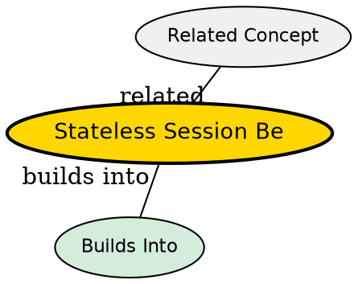

## The Problem

How do you handle single-request business processes efficiently without the overhead of maintaining client state?

## Core Idea

A *stateless* *session* bean is a session bean that holds conversations that span a single method call. It does not retain any conversational state between method invocations.

## How It Works

- After each method call, the container may destroy, recreate, or reuse the bean instance
- All instances of the same stateless session bean class are equivalent and indistinguishable
- Container can pool instances and reuse them across different clients
- Client must pass all required data as parameters to each method call
- Can hold non-client-specific state (e.g., database connection factory)

## Key Properties

- No conversational state retained between calls
- Supports instance pooling for scalability
- All instances are identical
- Single method call per conversation
- Examples: credit card verification, mathematical calculations, web service endpoints

## Visual Explanation

## Semantic Network

## Connections

- Built from: [[session-bean|Session Bean]]
- Builds into: [[instance-pooling|Instance Pooling]]
- Contrasts with: [[stateful-session-bean|Stateful Session Bean]], [[message-driven-bean|Message-Driven Bean]]
- Related: [[ejb-container|EJB Container]], [[transaction-demarcation|Transaction Demarcation]], [[queue-partitioning|Queue Partitioning]]

## Edge Cases & Gotchas

- Cannot maintain client-specific data between calls
- If container reuses instance, previous call's data is lost
- Stateless beans can still have instance variables--just don't rely on them persisting