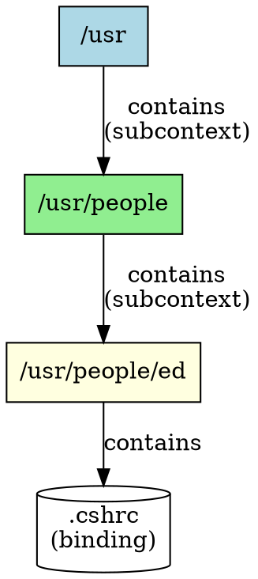

## The Problem
In a hierarchical naming system, we need to represent "folders within folders." How do we model nested containers where a context (like `/usr`) contains another full context (like `people`) that itself can contain bindings?

## Core Idea
A subcontext is a context that is contained within another context. For example, `/usr/people` is a subcontext of `/usr`. Each subcontext is a full-fledged context in its own right and can contain more bindings or additional subcontexts, enabling tree-structured naming.

## How It Works
1. A subcontext is created within a parent context using `createSubcontext()`
2. In file system terms, a subcontext is a "subfolder"
3. `/usr` is a context; `people` within `/usr` is a subcontext
4. Subcontexts can be nested arbitrarily deep (`/usr/people/ed`)
5. Each subcontext implements the full `Context` interface

## Visual Explanation

## Key Properties
- **Full context**: A subcontext is a complete Context, not a partial one
- **Nestable**: Can be nested arbitrarily deep
- **Tree structure**: Forms the hierarchical naming tree
- **Created via API**: `Context.createSubcontext(name)`
- **Resolved through path**: Accessed via compound names

## Connections
- Built from: [[jndi-context|JNDI Context]] — a subcontext is a type of context
- Built from: [[jndi-naming-concepts|JNDI Naming Concepts]] — subcontexts are a core concept
- Related: [[compound-name|Compound Name]] — compound names traverse subcontexts
- Related: [[jndi-binding|JNDI Binding]] — subcontexts contain bindings
- Builds into: [[jndi|JNDI]] — JNDI provides subcontext operations

## Edge Cases & Gotchas
- **Destroying subcontexts**: May fail if subcontext is not empty
- **Circular references**: Avoid creating circular subcontext structures
- **Provider support**: Not all providers support subcontext creation
- **Deep hierarchies**: Very deep nesting may impact performance

## Sources
- [[ejb6-summary|EJB6 Source Summary]]
