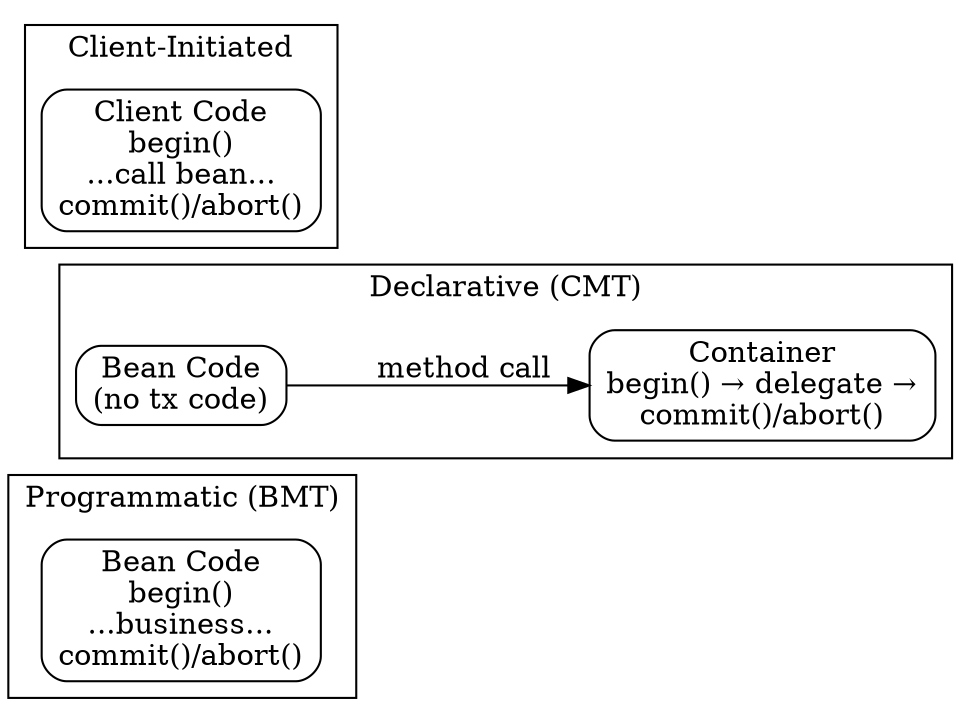

## The Problem
Transactions need clear boundaries: who starts (begin), who ends (commit/abort), and when. Without demarcation, there's ambiguity about transaction ownership, leading to errors where transactions are never committed or are committed at the wrong time.

## Core Idea
EJB supports three ways to demarcate (define boundaries of) transactions: **Programmatic** (bean writes begin/commit in code), **Declarative** (container automatically handles it via XML config), and **Client-Initiated** (client code controls transaction).

## How It Works

### 1. Programmatic Transactions (Bean-Managed - BMT)
- Bean explicitly calls `begin()`, `commit()`, `abort()` in Java code
- Full control over transaction boundaries; can run mini-transactions within a method
- Only allowed for: **Session Beans** and **Message-Driven Beans**
- **Illegal for Entity Beans** (container calls ejbLoad/ejbStore, not the bean)

### 2. Declarative Transactions (Container-Managed - CMT)
- No transaction code in bean; container auto-starts transaction on method entry, commits on exit
- Configured in `ejb-jar.xml`: `<transaction-type>Container</transaction-type>`
- Bean signals abort via exceptions or `setRollbackOnly()`
- **Required for all Entity Beans** (BMP and CMP)

### 3. Client-Initiated Transactions
- Client code (servlet, JSP, other EJB) begins and ends the transaction
- Bean still uses programmatic or declarative internally
- Downside: network failures cause more rollbacks in distributed systems
- Use sparingly, especially for remote clients

## Visual Explanation

## Key Properties
- **BMT:** Full control, mini-transactions possible, but more coding burden
- **CMT:** Simpler code, container handles everything, tuning without source access
- **Client-Initiated:** Client knows exact transaction outcome, but network issues cause rollbacks
- Entity Beans MUST use CMT (BMT is illegal for entity beans)
- Session Beans and MDBs can use BMT or CMT

## Connections
- Built from: [[transactions|Transactions]] — demarcation defines transaction boundaries
- Builds into: [[entity-bean-transactions|Entity Bean Transaction Rules]] — entity beans restricted to CMT
- Related: [[declarative-vs-programmatic-transactions|Comparison]] — detailed comparison of BMT vs CMT
- Related: [[poison-message|Poison Message]] — occurs with CMT in MDBs when rollback happens
- Related: [[ejb-deployment-descriptor|EJB Deployment Descriptor]] — CMT configured in XML

## Edge Cases & Gotchas
- BMT illegal for Entity Beans because container (not bean) calls ejbLoad/ejbStore
- Forgetting to call commit() in BMT causes transaction to never complete
- Client-initiated transactions over WAN have high rollback rates due to network failures
- BMT allows mini-transactions within a method; CMT/Client-Initiated apply to entire method

## Sources
- [[EJb4-summary|EJb4.md Source Summary]]
