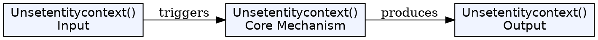
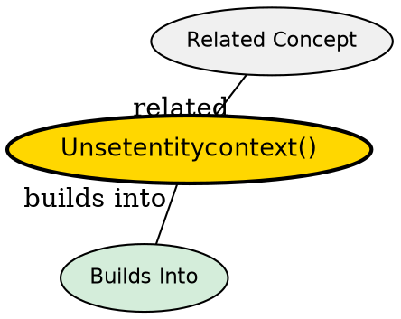

## The Problem

When the EJB container needs to reduce the pool size and destroy a bean instance, how does the bean clean up its association with the EntityContext?

## Core Idea

`unsetEntityContext()` is called by the container right before destroying a bean instance. It allows the bean to release any resources acquired in `setEntityContext()`.

## How It Works

- Container decides to remove a bean instance from the pool
- Container calls `unsetEntityContext()` to disassociate the bean from its context
- Bean should release any resources (connections, references)
- Bean instance becomes eligible for garbage collection

## Key Properties

- Called when container wants to shrink the pool
- Bean should clean up resources acquired in `setEntityContext()`
- Context is set to null after this call

## Visual Explanation

## Semantic Network

## Connections

- Built from: [[setentitycontext|setEntityContext()]], [[entity-context|Entity Context]]
- Related: [[instance-pooling|Instance Pooling]], [[ejb-container|EJB Container]]

## Edge Cases & Gotchas

- Don't perform database operations--call `ejbRemove()` first if needed