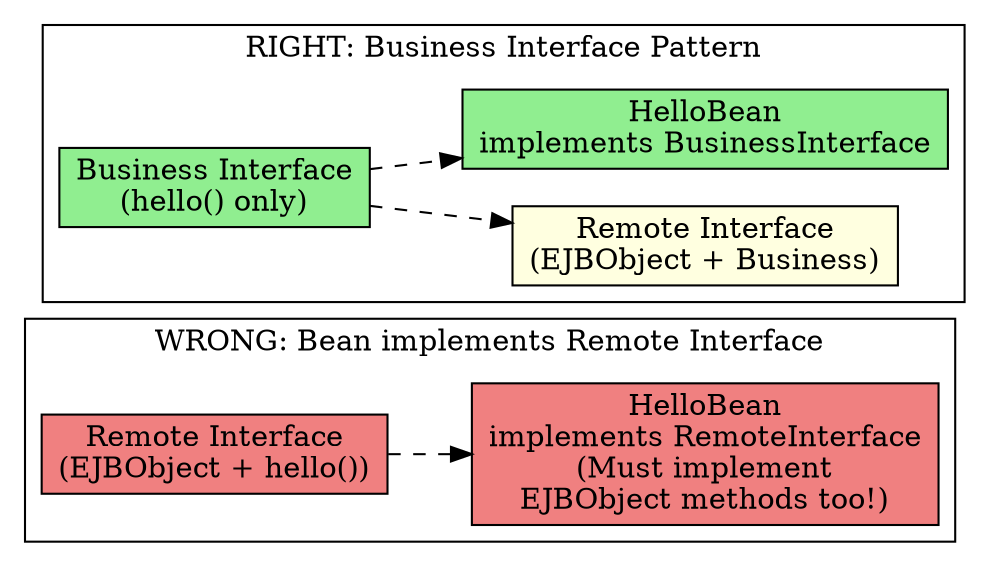

# Why Bean Doesn't Implement Component Interface

## The Problem
The component interface (Remote/Local) defines the business methods the client can call. It seems natural for the bean class to implement this interface directly—this would give compile-time checking that method signatures match. So why doesn't `HelloBean implements Hello`?

## Core Idea
There are two good reasons NOT to have the bean class implement the component interface:

1. **Pollution**: Component interfaces extend `EJBObject` or `EJBLocalObject`, which have extra methods (`remove()`, `getHandle()`, etc.) intended for clients. If the bean implements the interface, you'd need to provide no-op implementations of these methods—they don't belong in the bean.

2. **The "this" danger**: If the bean implements the same interface as the EJB object, you could accidentally pass `this` (the bean instance) to another bean instead of the EJB object (proxy). All clients must go through the proxy, never the bean directly.

## How It Works

**The Solution — Business Interface Pattern:**
```java
// Business interface (no EJB stuff)
public interface HelloBusinessMethods {
    String hello() throws RemoteException;
}

// Remote interface extends both EJBObject and business interface
public interface HelloRemote extends EJBObject, HelloBusinessMethods {}

// Bean implements business interface only
public class HelloBean implements SessionBean, HelloBusinessMethods {
    public String hello() { return "Hello, World!"; }
}
```

## Visual Explanation



## Key Properties
- **Separation of concerns**: Bean handles business logic, EJB Object handles middleware
- **Compile-time safety**: Business interface ensures bean has required methods
- **No pollution**: Bean doesn't contain client-specific methods (`remove()`, etc.)
- **Avoids `this` danger**: Bean can't accidentally pass itself (only EJB object gets passed)

## Connections
- **Built from:** [[remote-interface|Remote Interface]], [[ejb-object|EJB Object]]
- **Builds into:** [[session-bean|Session Bean]], [[entity-bean|Entity Bean]]
- **Related:** [[business-interface-pattern|Business Interface Pattern]]
- **Contrasts with:** Regular Java (where impl implements the interface directly)

## Edge Cases & Gotchas
- **Local interface problem**: The business interface pattern still causes local interfaces to throw `RemoteException`—annoying but tolerable
- **Not mandatory**: You CAN implement the component interface—it's just not recommended
- **Modern EJB (3.x+)**: Uses annotations (`@Remote`, `@Local`)—this problem is largely solved

## Sources
- [[ejb5-summary|EJB5 Source Summary]]
