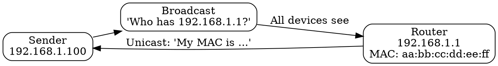

# ARP Protocol

## The Problem

You have an IP address (142.250.183.46) but need to send a packet on the local network (Ethernet). Local networks use MAC addresses, not IP addresses. Without ARP, you can't figure out which MAC address corresponds to an IP.

## Core Idea

ARP (Address Resolution Protocol) translates IP addresses to MAC addresses on local networks. It broadcasts "Who has this IP?" and the owner replies with its MAC address.

## How It Works

1. **Need MAC**: System wants to send packet to IP 192.168.1.1
2. **Check ARP Cache**: Is this IP already mapped? If yes, use cached MAC
3. **Broadcast Query**: "Who has IP 192.168.1.1? Tell 192.168.1.100"
4. **Reply**: The owner replies (unicast): "I have 192.168.1.1, my MAC is aa:bb:cc:dd:ee:ff"
5. **Cache**: Store in ARP cache for future use

ARP operates at Layer 2 (Data Link) and is essential for IPv4 over Ethernet.

## Visual Explanation

## Key Properties

- Only needed for IPv4 (IPv6 uses Neighbor Discovery)
- ARP cache has TTL (typically 2-20 minutes)
- Broadcast query, unicast response
- Operates below IP layer (Layer 2)

## Connections

- **Built from:** [[ip-address|IP Address]] — ARP translates IP to MAC
- **Builds into:** [[socket|Socket]] — sockets use MAC for local delivery
- **Related:** [[mac-address|MAC Address]] — what ARP resolves to
- **Related:** [[ethernet|Ethernet]] — ARP is used on Ethernet networks
- **Contrasts with:** [[dns-lookup|DNS Lookup]] — DNS is IP↔domain; ARP is MAC↔IP

## Edge Cases & Gotchas

- ARP spoofing attacks can redirect traffic (man-in-the-middle)
- ARP cache poisoning is a common attack vector
- Large networks can have many ARP entries (router burden)
- No authentication—anyone can reply to ARP queries

## Sources

- [[https-summary|HTTP HTTPS DNS URL Source]]
