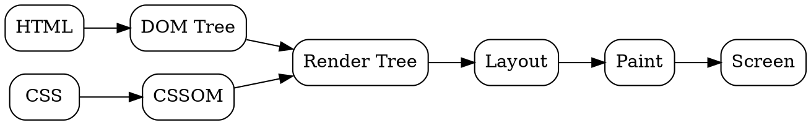

## The Problem

The browser has received an HTML response from the server. Now it needs to turn that raw text into pixels on the screen. Without a rendering pipeline, the user would just see a blank page or raw HTML source.

## Core Idea

Browser rendering is the multi-step pipeline that converts HTML, CSS, and JavaScript into visible pixels: parsing → style calculation → layout → paint → composite. Each step transforms the content into a more rendered form.

## How It Works

1. **HTML Parsing**: Build DOM tree from HTML
2. **CSS Parsing**: Build CSSOM (CSS Object Model) from stylesheets
3. **Render Tree**: Combine DOM + CSSOM (only visible elements)
4. **Layout**: Calculate position and size of each element
5. **Paint**: Fill in pixels for each element
6. **Composite**: Combine layers and send to GPU for display

Modern browsers use GPU acceleration for steps 5-6.

## Visual Explanation

## Key Properties

- Render-blocking: CSS blocks rendering (no paint without styles)
- JavaScript can block HTML parsing (unless `async`/`defer`)
- Layers enable GPU-accelerated compositing
- Reflow (layout recalculation) is expensive—avoid in loops

## Connections

- **Built from:** [[http-response|HTTP Response]] — HTML response triggers rendering
- **Builds into:** [[dom-tree|DOM Tree]] — first step of rendering
- **Related:** [[css-parsing|CSS Parsing]] — builds CSSOM
- **Related:** [[gpu-rendering|GPU Rendering]] — accelerates painting/compositing
- **Related:** [[layout|Layout]] — calculates element positions

## Edge Cases & Gotchas

- FOUC (Flash of Unstyled Content) if CSS loads slowly
- `display: none` removes element from render tree
- `visibility: hidden` keeps element in render tree (takes space)
- Forced synchronous layout (reading layout properties in JS) is slow

## Sources

- [[https-summary|HTTP HTTPS DNS URL Source]]
