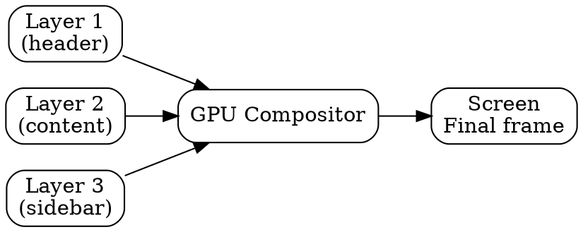

## The Problem

The browser has multiple painted layers (bitmaps), but the screen shows only one image. Without compositing, layers would overlap incorrectly or the GPU couldn't accelerate the final display.

## Core Idea

Compositing combines multiple painted layers into a single image for display. It's handled by the GPU for smooth scrolling, animations, and transforms.

## How It Works

1. **Layers ready**: Painting has created bitmap layers
2. **GPU composites**: GPU takes layers and combines them in order
   - Respect z-index and stacking context
   - Apply transforms, opacity, clips
3. **Final output**: Single frame sent to display

Modern browsers promote elements to layers for:
- `transform`, `opacity` animations
- `position: fixed`
- Video, canvas, iframe elements

## Visual Explanation

## Key Properties

- GPU-accelerated (fast, off-main-thread)
- Layers created for specific CSS properties
- Order matters: z-index, stacking context
- Enables smooth scrolling/animations without repainting

## Connections

- **Built from:** [[painting|Painting]] — painted layers are composited
- **Builds into:** [[gpu-rendering|GPU Rendering]] — compositing uses GPU
- **Related:** [[browser-rendering|Browser Rendering]] — compositing is step 7
- **Related:** [[css-layers|CSS Layers]] — promote elements to layers

## Edge Cases & Gotchas

- Too many layers = memory overhead
- Layer promotion with `will-change` can backfire
- Compositing doesn't fix slow JavaScript
- Not all CSS properties trigger compositing

## Sources

- [[https-summary|HTTP HTTPS DNS URL Source]]
