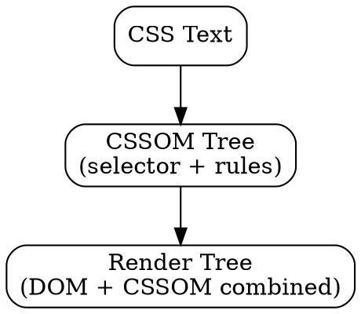

## The Problem

The browser receives CSS as text (from stylesheets, `<style>` tags, inline styles). To apply styles, the browser needs a structured representation of all CSS rules. Raw text isn't programmable.

## Core Idea

CSS parsing converts CSS text into the CSSOM (CSS Object Model)—a tree of style rules. This is used later to compute styles for each DOM element during render tree construction.

## How It Works

1. **Tokenization**: Break CSS text into tokens (`selector`, `{`, `property`, `value`, `}`)
2. **Parse rules**: Build CSSOM tree with selectors and declarations
   ```
   body { color: red; }
   ↓
   CSSOM: selector=body, declarations=[color: red]
   ```
3. **Style calculation**: Later, match CSSOM rules to DOM elements

CSS parsing can block rendering—browser won't paint until CSSOM is ready.

## Visual Explanation



## Key Properties

- CSSOM is separate from DOM (different trees)
- CSS parsing blocks rendering (need styles before paint)
- Media queries are evaluated during CSSOM construction
- Errors in CSS are silently ignored (lenient parsing)

## Connections

- **Builds into:** [[render-tree|Render Tree]] — CSSOM combines with DOM
- **Related:** [[dom-tree|DOM Tree]] — CSSOM is the CSS counterpart
- **Related:** [[browser-rendering|Browser Rendering]] — CSS parsing is step 2
- **Related:** [[cssom|CSSOM]] — the output of CSS parsing

## Edge Cases & Gotchas

- CSS at top of page (best practice)—blocks rendering until parsed
- `@import` causes additional network requests (slow)
- Invalid CSS silently fails (no error thrown)
- Large stylesheets = slow CSSOM construction

## Sources

- [[https-summary|HTTP HTTPS DNS URL Source]]
