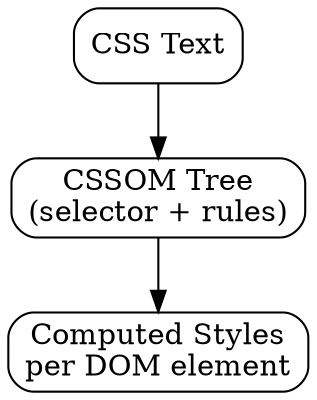

## The Problem

CSS is received as text, but the browser needs a structured representation to compute styles for each DOM element. Raw CSS text can't be queried programmatically.

## Core Idea

CSSOM (CSS Object Model) is the tree structure created by parsing CSS. It contains all style rules and is used to compute styles for each DOM element during render tree construction.

## How It Works

1. **CSS Received**: From stylesheets, `<style>` tags, inline styles
2. **Parse**: Convert to CSSOM tree
   ```
   body { color: red; }
   ↓
   CSSOM: selector=body, declarations=[color: red]
   ```
3. **Style computation**: For each DOM element, find matching CSSOM rules
4. **Cascading**: Apply specificity, inheritance, `!important`

## Visual Explanation



## Key Properties

- CSSOM is separate from DOM (different trees)
- JavaScript can manipulate CSSOM via `document.styleSheets`
- CSS parsing blocks rendering (need styles before paint)
- Media queries evaluated during CSSOM construction

## Connections

- **Built from:** [[css-parsing|CSS Parsing]] — CSSOM is the output
- **Builds into:** [[render-tree|Render Tree]] — CSSOM + DOM = render tree
- **Related:** [[dom-tree|DOM Tree]] — CSSOM styles are applied to DOM
- **Related:** [[browser-rendering|Browser Rendering]] — CSSOM is step 2

## Edge Cases & Gotchas

- `document.write()` in old browsers could break CSSOM
- Large stylesheets = slow CSSOM construction
- `@import` causes additional network requests
- CSSOM errors are silently ignored

## Sources

- [[https-summary|HTTP HTTPS DNS URL Source]]
