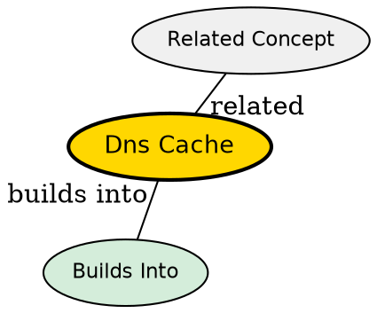

## The Problem

DNS lookups are slow when they have to traverse the full hierarchy (root → TLD → authoritative). Without caching, every page visit would require this full lookup, adding significant latency to every connection.

## Core Idea

DNS caching stores resolved domain-to-IP mappings at multiple levels (browser, OS, router, ISP) so that subsequent requests for the same domain don't need to repeat the full lookup process.

## How It Works

Each level maintains a cache with TTL-based expiry:

1. **Browser Cache**: Chrome/Firefox cache DNS for minutes to hours
2. **OS Cache**: Windows/Linux/macOS cache via DNS client service
3. **Router Cache**: Home/office routers cache for the local network
4. **ISP Cache**: ISP recursive resolvers cache for many users

When a request comes in:
- Check each cache in order
- If found (cache hit), return the IP immediately
- If not found (cache miss), continue to next level
- TTL (Time To Live) determines how long entries remain valid

## Visual Explanation

## Key Properties

- TTL (Time To Live) controls cache duration in seconds
- Each level can serve the cached result to speed up lookup
- Clearing cache forces a fresh lookup (useful for debugging)
- Cache poisoning is a security risk--false entries redirect traffic

## Semantic Network

## Connections

- **Built from:** [[dns-lookup|DNS Lookup]] -- caching is part of the lookup process
- **Related:** [[recursive-dns|Recursive DNS]] -- fallback when caches miss
- **Related:** [[dns-hierarchy|DNS Hierarchy]] -- caches store results from hierarchical queries
- **Contrasts with:** [[dns-lookup|DNS Lookup]] -- lookup is the full process; cache is just one optimization

## Edge Cases & Gotchas

- Stale cache entries point to old/incorrect IPs after server changes
- TTL too long = slow propagation of DNS changes
- TTL too short = unnecessary load on DNS servers
- `ipconfig /flushdns` clears Windows DNS cache