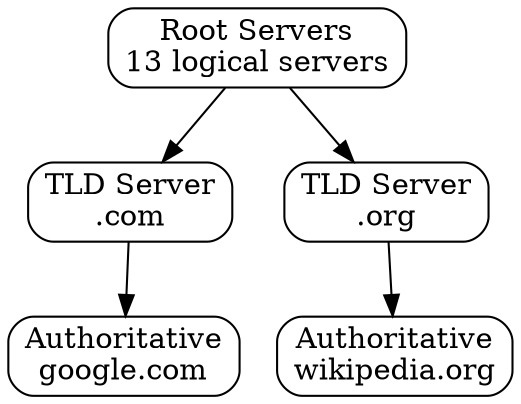

## The Problem

With millions of domains, a single DNS server cannot store all domain-to-IP mappings. Without a hierarchical structure, DNS would be a bottleneck and single point of failure for the entire internet.

## Core Idea

DNS uses a hierarchical distributed database structured like a tree: Root servers → TLD servers → Authoritative servers. Each level is responsible for a portion of the namespace, making the system scalable and fault-tolerant.

## How It Works

The DNS hierarchy has four levels:

1. **Root Servers** (13 logical servers globally): Know locations of TLD servers
   - Answer: "Where is .com server?"
   
2. **TLD Servers** (Top-Level Domain): Manage domains under a TLD (.com, .org, .net)
   - Answer: "Where is google.com server?"
   
3. **Authoritative Servers**: Know the actual IP for a specific domain
   - Answer: "google.com = 142.250.xx.xx"

4. **Recursive Resolvers** (ISP): Do the work of querying down the hierarchy

## Visual Explanation

## Key Properties

- Root servers are anycast (same IP, multiple physical locations)
- TLD servers handle specific top-level domains
- Authoritative servers are authoritative for specific domains
- Distributed design prevents single point of failure

## Connections

- **Built from:** [[recursive-dns|Recursive DNS]] — recursive resolvers navigate the hierarchy
- **Related:** [[dns-root-server|DNS Root Server]] — the top level of the hierarchy
- **Related:** [[dns-tld-server|DNS TLD Server]] — intermediate level for each TLD
- **Related:** [[dns-authoritative-server|DNS Authoritative Server]] — bottom level with actual records
- **Builds into:** [[dns-lookup|DNS Lookup]] — hierarchy is queried during DNS resolution

## Edge Cases & Gotchas

- Root server compromise would be catastrophic (but heavily protected)
- Some countries operate their own root servers (not part of ICANN)
- DNS hijacking can redirect at any hierarchy level
- Anycast allows multiple servers to share the same IP address