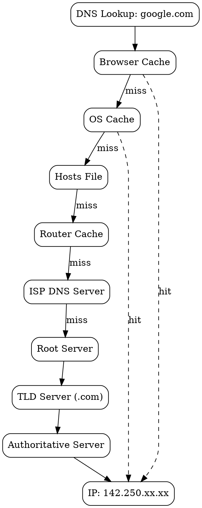
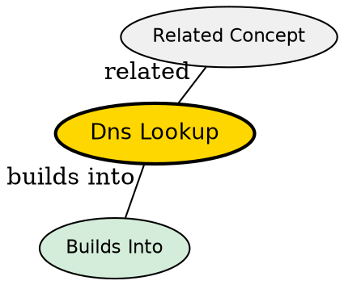

## The Problem

Humans remember domain names like `google.com`, but computers need IP addresses like `142.250.183.46` to route packets. Without DNS lookup, every website visit would require knowing its numeric IP address.

## Core Idea

DNS lookup is the process of translating a human-readable domain name into a machine-readable IP address. It checks multiple caches and queries a hierarchical chain of DNS servers to find the IP.

## How It Works

The lookup follows this priority order:

1. **Browser Cache**: Recently visited domains are cached by the browser
2. **OS Cache**: Operating system maintains its own DNS cache
3. **Hosts File**: Manual mappings (e.g., `127.0.0.1 localhost`)
4. **Router Cache**: Home/office router may cache DNS responses
5. **ISP DNS Server**: Internet provider's recursive resolver
6. **Recursive Resolution** (if not cached):
   - Root server: "Where is .com server?"
   - TLD server: "Where is google.com server?"
   - Authoritative server: "Here is the IP"

## Visual Explanation

## Key Properties

- Caching at every level speeds up repeated lookups
- TTL (Time To Live) controls how long entries are cached
- Recursive resolvers do the work so clients don't need to query multiple servers
- UDP port 53 is used for standard queries (TCP for large responses)

## Semantic Network

## Connections

- **Built from:** [[dns-cache|DNS Cache]] -- caching is core to DNS lookup efficiency
- **Builds into:** [[tcp-handshake|TCP Handshake]] -- IP from DNS used to establish TCP connection
- **Related:** [[dns-hierarchy|DNS Hierarchy]] -- the chain of servers queried
- **Related:** [[arp-protocol|ARP Protocol]] -- after DNS gives IP, ARP finds MAC address
- **Contrasts with:** [[recursive-dns|Recursive DNS]] -- DNS lookup includes caching, recursive is the fallback mechanism

## Edge Cases & Gotchas

- DNS poisoning can redirect users to malicious sites
- Cache poisoning attacks exploit trust in DNS responses
- Some ISPs hijack failed DNS lookups to show ads
- DNS over HTTPS (DoH) encrypts DNS queries for privacy