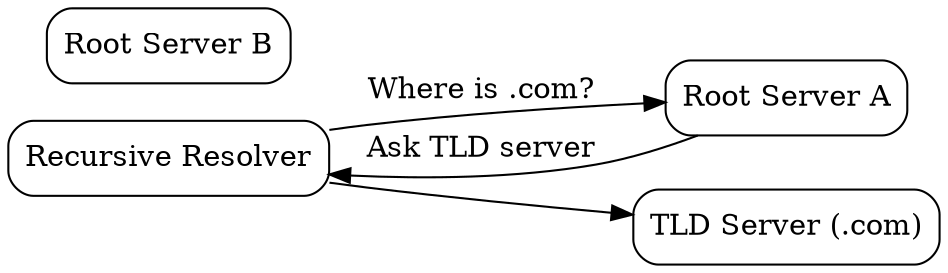

## The Problem

When a DNS resolver doesn't know where to find a domain, it needs a starting point. Without root servers, there would be no way to begin the DNS resolution process for unknown domains.

## Core Idea

DNS root servers are the top of the DNS hierarchy—13 logical servers (labeled A through M) that know the locations of all TLD servers. They are the starting point for all recursive DNS lookups.

## How It Works

1. **Query Received**: Recursive resolver has a new domain to resolve
2. **Contact Root**: Resolver sends query to a root server
3. **Response**: Root server returns the TLD server for the domain's extension
   - For `google.com`, root returns `.com` TLD server address
4. **Next Step**: Resolver now queries the TLD server

Root servers don't know the final IP—they only know which TLD server to ask next.

## Visual Explanation

## Key Properties

- 13 logical servers (A-M), hundreds of physical servers via anycast
- Managed by different organizations (ICANN, Verisign, etc.)
- Only return TLD server addresses, never final IPs
- Root zone file contains all TLD server addresses

## Connections

- **Built from:** [[recursive-dns|Recursive DNS]] — resolvers query root servers
- **Builds into:** [[dns-tld-server|DNS TLD Server]] — root points to TLD servers
- **Related:** [[dns-hierarchy|DNS Hierarchy]] — root is the top level
- **Related:** [[anycast|Anycast]] — root servers use anycast for redundancy

## Edge Cases & Gotchas

- Root server compromise would break the entire internet
- Root servers are heavily DDoS protected
- Some countries operate alternative root systems (not ICANN-recognized)
- Anycast allows multiple physical servers to share one IP

## Sources

- [[https-summary|HTTP HTTPS DNS URL Source]]
