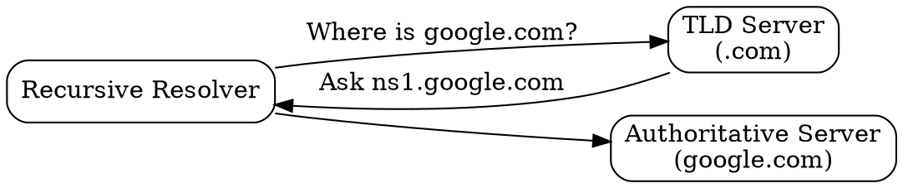

## The Problem

After the root server tells you where `.com` is, you need to find the specific server for `google.com`. TLD servers bridge the gap between root servers and authoritative servers for each domain extension.

## Core Idea

TLD (Top-Level Domain) servers manage all domains under a specific extension (.com, .org, .net, etc.). They know the addresses of authoritative servers for each domain registered under that TLD.

## How It Works

1. **Query from Resolver**: "Where is google.com?"
2. **TLD Lookup**: TLD server checks its zone file for `google.com`
3. **Response**: Returns the authoritative name server for that domain
   - Example: "google.com is served by ns1.google.com"
4. **Next Step**: Resolver queries the authoritative server

TLDs are managed by organizations like Verisign (.com, .net), PIR (.org), etc.

## Visual Explanation

## Key Properties

- One TLD server handles all domains under that extension
- Zone files contain authoritative server mappings
- Managed by registries (Verisign for .com, etc.)
- Respond with NS (Name Server) records, not IP addresses

## Connections

- **Built from:** [[dns-root-server|DNS Root Server]] — root server points to TLD server
- **Builds into:** [[dns-authoritative-server|DNS Authoritative Server]] — TLD points to authoritative
- **Related:** [[dns-hierarchy|DNS Hierarchy]] — TLD is the middle layer
- **Related:** [[domain-registration|Domain Registration]] — TLD servers updated via registrars

## Edge Cases & Gotchas

- TLD server downtime affects all domains under that TLD
- Some TLDs have more stringent policies (.gov, .edu)
- Country-code TLDs (.uk, .jp) have local governance
- New gTLDs (.app, .dev) added regularly

## Sources

- [[https-summary|HTTP HTTPS DNS URL Source]]
