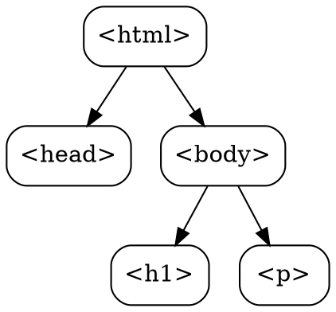

## The Problem

The browser receives HTML as a text string. To render the page and allow JavaScript to manipulate it, the browser needs a structured representation of the document. Raw HTML text isn't programmable.

## Core Idea

The DOM (Document Object Model) tree is a tree structure built by parsing HTML, where each HTML element becomes a node. It's the programmatic interface that JavaScript uses to read and modify the page.

## How It Works

1. **HTML Received**: Browser starts receiving HTML from server
2. **Tokenization**: HTML is broken into tokens (`<div>`, `class=`, etc.)
3. **Tree Construction**: Tokens are assembled into a tree
   ```
   html
   ├── head
   │   └── title
   └── body
       ├── h1
       └── p
   ```
4. **Scripts may modify**: JavaScript can add/remove nodes

The DOM is live—changes via JavaScript immediately affect the structure.

## Visual Explanation



## Key Properties

- Tree structure mirrors HTML nesting
- JavaScript can traverse and modify the DOM
- `document.getElementById()` etc. query the DOM
- DOM changes trigger re-rendering (reflow/repaint)

## Connections

- **Built from:** [[browser-rendering|Browser Rendering]] — DOM is step 1
- **Builds into:** [[render-tree|Render Tree]] — DOM + CSSOM combine
- **Related:** [[html-parsing|HTML Parsing]] — the process that builds the DOM
- **Related:** [[cssom|CSSOM]] — CSS counterpart to DOM
- **Related:** [[javascript|JavaScript]] — manipulates the DOM

## Edge Cases & Gotchas

- Malformed HTML gets corrected by parser (auto-close tags)
- `document.write()` during parsing can break things
- Large DOM = slow rendering and JS operations
- DOM is not the same as HTML source (parser fixes errors)

## Sources

- [[https-summary|HTTP HTTPS DNS URL Source]]
