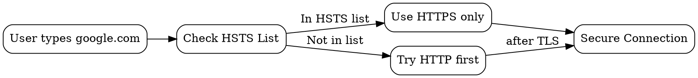

## The Problem

Users might accidentally visit the HTTP version of a site instead of HTTPS, exposing them to downgrade attacks. Without HSTS, a man-in-the-middle could strip TLS and force a connection to use insecure HTTP.

## Core Idea

HTTP Strict Transport Security (HSTS) is a security policy that tells browsers to always use HTTPS for a domain, never allowing HTTP fallback. It prevents protocol downgrade attacks and cookie hijacking.

## How It Works

1. **First Visit**: Server sends `Strict-Transport-Security` header with `max-age` value
2. **Browser Records**: Browser stores the HSTS policy for the specified duration
3. **Subsequent Visits**: Browser automatically upgrades HTTP requests to HTTPS
4. **Preload List**: Popular sites are hardcoded into browser HSTS preload lists

When a site is in the HSTS list, the browser:
- Never attempts HTTP for that domain
- Refuses to connect if certificate errors occur (no "proceed anyway" option)

## Visual Explanation

## Key Properties

- Header: `Strict-Transport-Security: max-age=31536000; includeSubDomains`
- Prevents SSL stripping man-in-the-middle attacks
- Browsers refuse to bypass certificate errors for HSTS sites
- `includeSubDomains` extends policy to all subdomains

## Connections

- **Built from:** [[https|HTTPS]] — HSTS enforces HTTPS usage
- **Contrasts with:** [[http|HTTP]] — HSTS explicitly prevents HTTP fallback
- **Related:** [[tls-handshake|TLS Handshake]] — HSTS ensures TLS is always used
- **Related:** [[url-parsing|URL Parsing]] — HSTS check happens after URL is parsed

## Edge Cases & Gotchas

- First visit before HSTS is set is still vulnerable (use preload list)
- Max-age expiry requires re-visit to refresh policy
- `includeSubDomains` can break subdomains not ready for HTTPS
- Cannot be disabled by user even if site has issues (must wait for expiry)