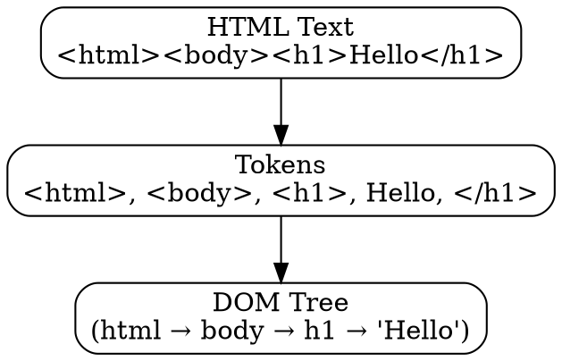

## The Problem

The browser receives HTML as a text string from the server. To build the DOM and render the page, the browser needs to convert this text into a structured tree. Raw HTML isn't programmable.

## Core Idea

HTML parsing tokenizes HTML text and constructs the DOM tree. The parser is lenient—it corrects malformed HTML automatically (missing closing tags, mismatched tags, etc.).

## How It Works

1. **Tokenization**: Break HTML into tokens (`<div>`, `class=`, text content, `</div>`)
2. **Tree construction**: Assemble tokens into DOM tree
   ```
   <html>
     <body>
       <h1>Hello</h1>
   ```
   ↓
   DOM: html → body → h1 → "Hello"
   ```
3. **Error recovery**: Fix common HTML errors automatically

The HTML parser can be paused by `<script>` tags (unless `async`/`defer`).

## Visual Explanation



## Key Properties

- Lenient parsing: fixes errors automatically
- Scripts block parsing (unless async/defer)
- Incremental parsing: starts before full HTML arrives
- Output is the DOM tree

## Connections

- **Builds into:** [[dom-tree|DOM Tree]] — HTML parsing creates the DOM
- **Related:** [[browser-rendering|Browser Rendering]] — HTML parsing is step 1
- **Related:** [[css-parsing|CSS Parsing]] — parallel but separate process
- **Contrasts with:** [[xml-parsing|XML Parsing]] — HTML is lenient, XML is strict

## Edge Cases & Gotchas

- `<script>` without `async`/`defer` blocks parsing
- `document.write()` during parsing can break things
- Malformed HTML gets "fixed" (may not match intent)
- Table parsing is especially complex

## Sources

- [[https-summary|HTTP HTTPS DNS URL Source]]
