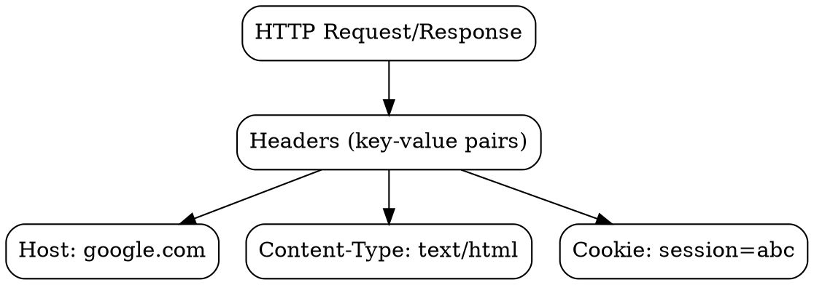

## The Problem

HTTP requests and responses need metadata—who is making the request? What type of content is being sent? How should the response be cached? Without headers, HTTP would only be able to send raw data with no context.

## Core Idea

HTTP headers are key-value pairs sent with requests and responses that provide metadata: content type, authentication, caching instructions, cookies, and more. They're the extension mechanism that lets HTTP evolve without changing the protocol.

## How It Works

Headers appear after the request/status line, one per line:

**Request Headers:**
```
Host: google.com
User-Agent: Mozilla/5.0
Cookie: session=abc123
Authorization: Bearer token123
```

**Response Headers:**
```
Content-Type: text/html
Cache-Control: max-age=3600
Set-Cookie: session=abc123
```

Headers are case-insensitive and can appear in any order.

## Visual Explanation



## Key Properties

- Case-insensitive names (Host = host = HOST)
- Multiple values possible (e.g., multiple Accept headers)
- Standard headers vs custom `X-` headers (deprecated but still seen)
- Headers affect caching, auth, content negotiation, CORS

## Connections

- **Built from:** [[http-request|HTTP Request]] — headers are part of requests
- **Builds into:** [[http-response|HTTP Response]] — headers are part of responses
- **Related:** [[cookies|Cookies]] — sent via Cookie/Set-Cookie headers
- **Related:** [[cors|CORS]] — controlled by special headers
- **Related:** [[cache-control|Cache Control]] — caching headers

## Edge Cases & Gotchas

- Large headers can cause issues (proxy limits, 431 error)
- Header injection attacks possible with untrusted input
- Some headers are hop-by-hop (not forwarded by proxies)
- Duplicate headers may be merged or cause errors

## Sources

- [[https-summary|HTTP HTTPS DNS URL Source]]
