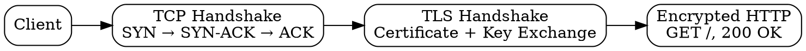

# HTTPS

## The Problem

HTTP sends data in plain text—anyone between client and server can read passwords, cookies, and private data. Without encryption, the web would be unsafe for banking, shopping, or any private communication.

## Core Idea

HTTPS is HTTP over TLS/SSL encryption. It wraps HTTP inside an encrypted tunnel, protecting data from eavesdropping, tampering, and man-in-the-middle attacks.

## How It Works

1. **TCP Handshake**: Establish TCP connection (3-way handshake)
2. **TLS Handshake**: Negotiate encryption, verify certificate, establish shared key
3. **Encrypted HTTP**: All HTTP requests/responses are encrypted with the shared key
4. **Decrypt**: Server decrypts request, sends encrypted response

The browser shows a lock icon  for HTTPS sites.

## Visual Explanation

## Key Properties

- HTTP + TLS encryption (default port 443)
- Protects against eavesdropping, tampering, MITM
- Requires SSL/TLS certificate from trusted CA
- Slower than HTTP (TLS handshake overhead)

## Connections

- **Built from:** [[http|HTTP]] — HTTPS is HTTP over TLS
- **Built from:** [[tls-handshake|TLS Handshake]] — HTTPS requires TLS
- **Built from:** [[tcp-handshake|TCP Handshake]] — TCP comes first
- **Related:** [[hsts|HSTS]] — enforces HTTPS usage
- **Contrasts with:** [[http|HTTP]] — HTTP is plain text, HTTPS is encrypted

## Edge Cases & Gotchas

- Mixed content warnings (HTTPS page loading HTTP resources)
- Certificate expiration breaks HTTPS (browser warning)
- TLS 1.3 is faster (1-RTT handshake)
- Some networks block HTTPS (deep packet inspection)

## Sources

- [[https-summary|HTTP HTTPS DNS URL Source]]
