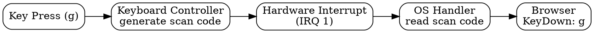
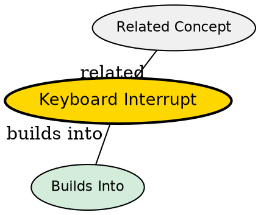

## The Problem

When you press a key, the computer needs to know about it immediately. Without interrupts, the CPU would have to constantly poll (check) the keyboard, wasting cycles.

## Core Idea

A keyboard interrupt is a hardware signal sent to the CPU when a key is pressed (or released). The keyboard controller converts the physical keypress into a scan code and triggers an interrupt for the OS to handle.

## How It Works

1. **Key press**: Physical switch closes in keyboard matrix
2. **Scan code**: Keyboard controller generates scan code (e.g., `g` = code 0x22)
3. **Interrupt**: Keyboard raises hardware interrupt (IRQ 1 on x86)
4. **OS handler**: CPU jumps to interrupt handler, reads scan code
5. **To application**: OS delivers key event to active app (browser)

USB keyboards poll at ~10ms instead of generating interrupts.

## Visual Explanation

## Key Properties

- Scan codes are hardware-specific (not ASCII)
- USB polls at ~10ms (not true interrupts)
- OS converts scan codes to characters
- Interrupt Vector Table maps IRQ to handler

## Semantic Network

## Connections

- **Builds into:** [[os-interrupt-handler|OS Interrupt Handler]] -- OS handles the interrupt
- **Related:** [[keyboard-matrix|Keyboard Matrix]] -- physical circuit for keys
- **Related:** [[scan-code|Scan Code]] -- what keyboard controller generates
- **Contrasts with:** [[polling|Polling]] -- interrupts vs continuous checking

## Edge Cases & Gotchas

- Key repeat triggers multiple interrupts (hold key down)
- USB keyboards don't use hardware interrupts (polling)
- Some keys have two-byte scan codes (extended keys)
- Interrupt storms can overwhelm CPU (too many fast keypresses)