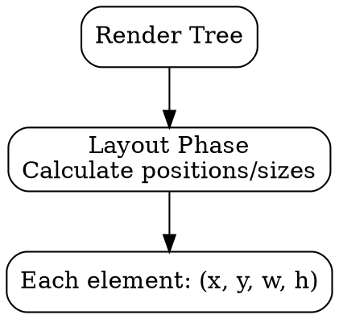

## The Problem

The render tree has elements with styles, but the browser doesn't yet know where to put them on the screen. Without layout calculation, everything would overlap at position (0,0).

## Core Idea

Layout (also called reflow) calculates the exact position (x,y) and size (width, height) of each element in the render tree. It runs the CSS box model algorithm to determine where pixels go.

## How It Works

1. **Start at root**: Begin with `<html>` element
2. **Box model**: Calculate width, height, padding, border, margin per element
3. **Flow**: Block elements stack vertically, inline elements flow horizontally
4. **Positioning**: Apply `position`, `float`, `flexbox`, `grid` rules
5. **Output**: Each element gets (x, y, width, height)

```
Element: <div>
- x: 100px, y: 50px
- width: 500px, height: 200px
```

## Visual Explanation



## Key Properties

- Also called "reflow" when triggered again after initial layout
- Runs the CSS box model algorithm
- Parent elements affect children (containing blocks)
- Expensive operation—avoid forced synchronous layout

## Connections

- **Built from:** [[render-tree|Render Tree]] — layout takes render tree as input
- **Builds into:** [[painting|Painting]] — layout output used for painting
- **Related:** [[css-box-model|CSS Box Model]] — defines width/height calculation
- **Related:** [[browser-rendering|Browser Rendering]] — layout is step 4

## Edge Cases & Gotchas

- Reading offsetWidth/Height triggers synchronous layout (slow!)
- `display: none` → `display: block` triggers full reflow
- Animations with `top`/`left` cause continuous reflow (use `transform` instead)
- Table layout is especially expensive