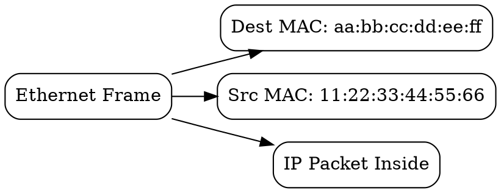

## The Problem

On a local network (Ethernet, Wi-Fi), devices need unique identifiers to deliver packets to the correct machine. IP addresses can change, but hardware needs a permanent identifier for Layer 2 communication.

## Core Idea

A MAC address is a 48-bit hardware identifier (e.g., `aa:bb:cc:dd:ee:ff`) burned into a network interface card (NIC). It's used by Ethernet and Wi-Fi to deliver frames to the correct device on the local network.

## How It Works

1. **Structure**: 6 bytes = 48 bits, typically written as hex pairs (aa:bb:cc:dd:ee:ff)
2. **Uniqueness**: First 3 bytes = OUI (Organizationally Unique Identifier, assigned to vendor)
3. **Delivery**: Network switches read destination MAC to forward frames
4. **Resolution**: [[arp-protocol|ARP]] maps IP addresses to MAC addresses

MAC addresses operate at Layer 2 (Data Link), while IP addresses operate at Layer 3 (Network).

## Visual Explanation

## Key Properties

- 48 bits = 2^48 ≈ 281 trillion possible addresses
- Burned into hardware (but can be software-overridden)
- Used by switches to learn port-to-MAC mappings
- First 3 bytes indicate manufacturer (OUI)

## Connections

- **Built from:** [[ethernet|Ethernet]] — MAC addresses are used by Ethernet
- **Builds into:** [[arp-protocol|ARP Protocol]] — ARP resolves IP to MAC
- **Related:** [[ip-address|IP Address]] — IP is Layer 3; MAC is Layer 2
- **Related:** [[network-switch|Network Switch]] — switches forward based on MAC

## Edge Cases & Gotchas

- MAC addresses can be spoofed (changed in software)
- VPNs hide your real MAC address
- Wi-Fi uses MAC filtering for access control (easily bypassed)
- Random MAC addresses used by some devices for privacy

## Sources

- [[https-summary|HTTP HTTPS DNS URL Source]]
