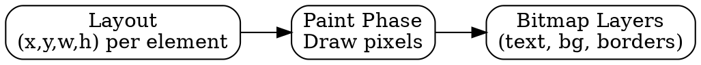

## The Problem

The browser knows where each element goes (layout), but the screen is still blank. The pixels haven't been drawn yet. Without painting, the user would see nothing.

## Core Idea

Painting (rasterization) converts the layout output into actual pixels. Each element is drawn into layers (bitmaps) that will later be composited together.

## How It Works

1. **Input**: Layout gives (x, y, width, height) for each element
2. **Fill pixels**: Draw text, backgrounds, borders, shadows
3. **Create layers**: Elements may be promoted to separate layers
4. **Output**: Bitmap layers ready for compositing

Painting is done by the browser's rendering engine (Blink, Gecko, WebKit).

## Visual Explanation

## Key Properties

- Converts vectors (layout) to rasters (pixels)
- Each element can be in a different layer
- `will-change` hints browser to create a layer
- CPU-intensive for complex styles (shadows, gradients)

## Connections

- **Built from:** [[layout|Layout]] — painting uses layout output
- **Builds into:** [[compositing|Compositing]] — layers get combined
- **Related:** [[gpu-rendering|GPU Rendering]] — can accelerate painting
- **Related:** [[browser-rendering|Browser Rendering]] — painting is step 5

## Edge Cases & Gotchas

- Large repaints are expensive (full-screen redraw)
- `box-shadow` and `border-radius` slow down painting
- Layers help—only repaint changed elements
- Forced repaint (reading `getComputedStyle`) is slow