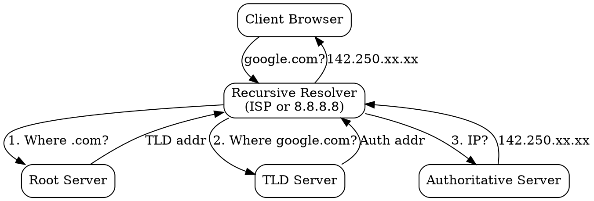

## The Problem

Clients (browsers) don't want to query root, TLD, and authoritative servers themselves—that's too complex and slow. Recursive DNS resolvers do all the work so clients just get the final answer.

## Core Idea

A recursive DNS resolver is a server (usually your ISP's or a public one like 8.8.8.8) that performs the full DNS lookup on behalf of clients. It queries root → TLD → authoritative servers and returns only the final IP.

## How It Works

1. **Client Query**: "What is google.com's IP?"
2. **Cache Check**: Resolver checks its cache first
3. **Recursive Lookup** (if not cached):
   - Query root server → get TLD server
   - Query TLD server → get authoritative server
   - Query authoritative server → get IP
4. **Cache & Return**: Store in cache (per TTL), return IP to client

Public recursive resolvers: Google (8.8.8.8), Cloudflare (1.1.1.1), Quad9 (9.9.9.9).

## Visual Explanation

## Key Properties

- Does the heavy lifting so clients don't have to
- Caches results for many clients (improves performance)
- Can be ISP-provided or public (Google, Cloudflare)
- Recursive = will query until it gets the final answer

## Connections

- **Built from:** [[dns-hierarchy|DNS Hierarchy]] — navigates the full hierarchy
- **Builds into:** [[dns-lookup|DNS Lookup]] — recursive is the fallback when caches miss
- **Related:** [[dns-cache|DNS Cache]] — resolvers cache aggressively
- **Related:** [[public-dns|Public DNS]] — Google DNS, Cloudflare, Quad9

## Edge Cases & Gotchas

- ISP resolvers may hijack failed lookups to show ads
- DNS over HTTPS (DoH) encrypts queries to recursive resolver
- Some resolvers filter malicious domains (Quad9)
- Recursion can be disabled (authoritative-only servers)