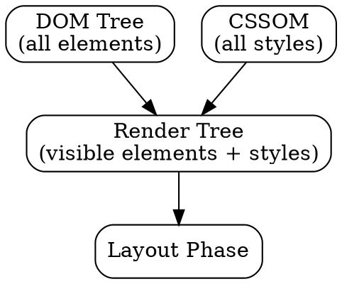

## The Problem

The DOM tree has all HTML elements, but not all are visible (e.g., `<head>`, `display: none`). The CSSOM has all styles, but not all apply to every element. We need a combined tree of only visible elements with their styles attached.

## Core Idea

The render tree combines the DOM tree and CSSOM, keeping only visible elements and attaching their computed styles. This is the tree used for layout and painting—invisible elements are excluded.

## How It Works

1. **Start with DOM**: Traverse the DOM tree
2. **Check visibility**: Skip elements that are `display: none` or in `<head>`
3. **Attach styles**: For each visible element, compute its styles from CSSOM
4. **Build render tree**: New tree with visible elements + computed styles

```
DOM: <div style="display:none"> (skipped)
DOM: <h1> (included, with styles attached)
```

## Visual Explanation



## Key Properties

- Only visible elements included (`display: none` excluded)
- Each node has computed styles (inherited + specified + default)
- Render tree nodes are called "render objects" or "frames"
- Changes to DOM or CSS can trigger render tree reconstruction

## Connections

- **Built from:** [[dom-tree|DOM Tree]] — provides the structure
- **Built from:** [[cssom|CSSOM]] — provides the styles
- **Builds into:** [[layout|Layout]] — render tree is input to layout
- **Related:** [[browser-rendering|Browser Rendering]] — render tree is step 3
- **Contrasts with:** [[dom-tree|DOM Tree]] — DOM has everything; render tree has only visible

## Edge Cases & Gotchas

- `visibility: hidden` elements ARE in render tree (take space, just invisible)
- `display: none` elements are NOT in render tree
- Pseudo-elements (`::before`) are in render tree but not DOM
- Rebuilding render tree is expensive (triggers layout + paint)

## Sources

- [[https-summary|HTTP HTTPS DNS URL Source]]
