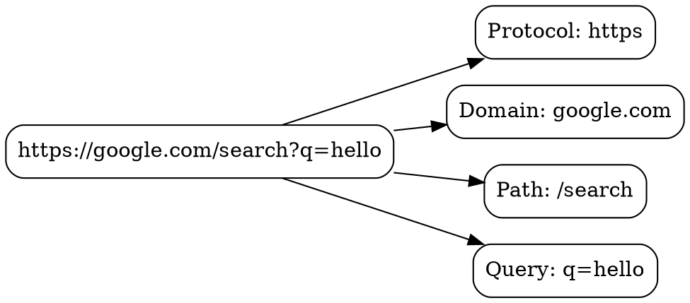

## The Problem

When you type a URL into a browser, the browser needs to understand what resource you're requesting and how to reach it. Without parsing, the browser wouldn't know which protocol to use, which server to contact, or which resource to fetch.

## Core Idea

URL parsing is the process of breaking a URL string into its component parts: protocol, domain, path, query parameters, and fragments. This allows the browser to understand the request and route it correctly.

## How It Works

1. **Extract Protocol**: Browser identifies the scheme (e.g., `https://`) to determine the protocol
2. **Extract Domain**: The hostname (e.g., `google.com`) is separated for DNS resolution
3. **Extract Path**: The resource path (e.g., `/search`) tells the server which resource to return
4. **Extract Query**: Query parameters (e.g., `?q=hello`) provide additional request data
5. **Extract Fragment**: The fragment (e.g., `#section`) identifies a specific part of the page

Example: `https://google.com/search?q=hello`
- Protocol: `https`
- Domain: `google.com`
- Path: `/search`
- Query: `q=hello`

## Visual Explanation

## Key Properties

- Browser first checks if input is a URL or search term
- Non-ASCII Unicode characters in hostname get converted/encoded
- Missing protocol defaults to https (or http for some browsers)
- Malformed URLs trigger error pages or search fallback

## Connections

- **Built from:** [[http|HTTP]] — URL specifies which HTTP resource to fetch
- **Builds into:** [[dns-lookup|DNS Lookup]] — domain from URL needs DNS resolution
- **Related:** [[hsts|HSTS]] — security check happens after URL parsing
- **Related:** [[browser-autocomplete|Browser Autocomplete]] — operates on URL input during typing

## Edge Cases & Gotchas

- `google` alone might be treated as search term, not URL
- URLs with non-ASCII characters need percent-encoding
- Trailing slashes can sometimes change server behavior
- Browser address bar "pretty prints" URLs (hides protocol, simplifies display)

## Sources

- [[https-summary|HTTP HTTPS DNS URL Source]]
