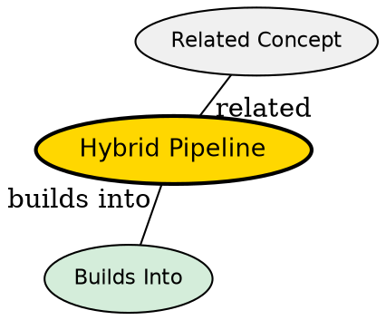

## The Problem

Marketing image generation requires both **language reasoning** (understanding complex briefs, brand requirements, structured output) and **high-fidelity visual synthesis** (photorealistic images, precise text rendering, brand-consistent styling). No single model family handles both well enough for commercial production use.

- Pure diffusion pipelines can't reason over complex briefs
- Pure LLM pipelines can't produce photorealistic marketing imagery
- Unified multimodal models lack fine-tuning granularity for brand control

## Core Idea

A hybrid architecture that combines an LLM for language understanding/reasoning with a diffusion model for pixel synthesis. The LLM handles cognitive tasks (brief decomposition, prompt structuring), while the diffusion model handles visual generation (image synthesis, text rendering). They communicate through structured data schemas, not raw text.

## How It Works

```
User Brief (natural language)
         ↓
   Brief Decomposer (LLM)
   → Structured Schema: {subject, style, lighting, camera, mood, text_to_render}
         ↓
   Prompt Composer (LLM)
   → Weighted prompt string + negative prompt + glyph instructions
         ↓
   Reference Asset Injection (IP-Adapter) → Optional brand image conditioning
         ↓
   ControlNet (optional) → Spatial structure / glyph enforcement
         ↓
   Flux.1-dev + Client LoRA → Image synthesis
         ↓
   Quality Gate (CLIP + Aesthetic) → Auto-reject/retries
         ↓
   Upscaler → Final high-res output
```

## Key Properties

- **Separation of concerns**: LLM handles cognition, diffusion handles generation
- **Structured intermediate outputs**: JSON schemas make system auditable and debuggable
- **Modular components**: Each stage is swappable (LLM, diffusion model, control mechanisms)
- **Production-ready**: Supports async job queues, per-client LoRA hot-swapping, quality gates


## Visual Explanation


## Semantic Network


## Connections

- Built from: [[diffusion-models]], [[transformers]], [[clip]], [[t5-encoder]]
- Builds into: [[flux-architecture]], [[lora-finetuning]], [[controlnet]]
- Related: [[text-rendering-problem]], [[latent-space]], [[vae]]

## Edge Cases & Gotchas

- **LLM quality determines everything**: A mediocre prompt decomposer ruins downstream output
- **Latency compounding**: Each LLM call adds 1-3 seconds; pipeline needs async handling
- **CLIP vs T5 tradeoff**: CLIP faster but character-blind; T5 slower but spelling-aware