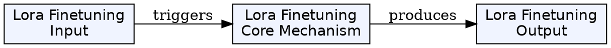
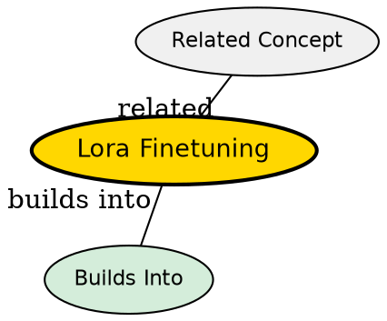

## The Problem

How do you make a diffusion model produce outputs in a specific client's brand style (colors, lighting, composition) without retraining the entire model from scratch? Full fine-tuning is expensive, slow, and requires massive GPU resources.

## Core Idea

LoRA (Low-Rank Adaptation) adds small "adapter" weights to a pre-trained model. Instead of updating all 12B parameters, LoRA adds ~100MB of new weights that modify the model's behavior. The base model stays frozen -- you just load different adapters for different clients.

## How It Works

### Low-Rank Decomposition

LoRA adds two small matrices (rank r, typically 8-16) that approximate the weight change. Instead of updating a W matrix directly, you learn W + BA where B and A are small.

### Training

- Freeze the base model (Flux.1-dev)
- Add LoRA layers in parallel to attention weights
- Train on 20-50 brand images for a few hours
- Result: ~100MB .safetensors file

### Inference

- Load base Flux.1-dev (one time)
- Hot-swap LoRA files per client
- Merge at runtime -- no model reload needed

### Three LoRA Types in Our Pipeline

1. **Base Aesthetic LoRA** -- Trained on LAION-Art, gives professional photography look
2. **Brand-Specific LoRA** -- Trained on each client's 20-50 images
3. **Client LoRA** -- Hot-swapped per job

## Key Properties

- ~100MB per LoRA (vs 12GB for full model)
- Training takes hours, not days
- Hot-swappable at inference time
- Can merge multiple LoRAs (base + brand)

## Visual Explanation

## Semantic Network

## Connections

- Built from: [[diffusion-models]], [[neural-networks]]
- Used in: [[hybrid-pipeline]], [[flux-architecture]]
- Related: [[ip-adapter]]

## Edge Cases & Gotchas

- LoRA good for style, weak for exact product shapes
- Need quality training data (20-50 consistent images)
- Too many LoRAs = management overhead