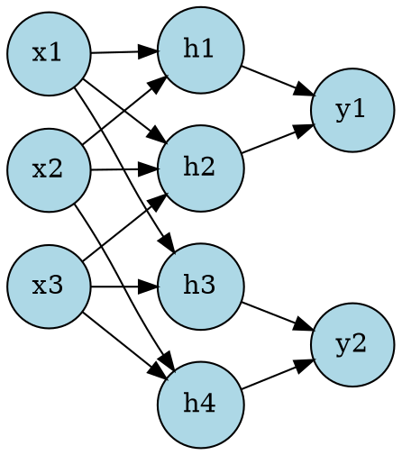

## The Problem
Traditional AI used symbolic, rule-based approaches that couldn't handle perception tasks (image recognition, speech) or learn from examples. There was no system that could learn patterns from data the way biological brains do.

## Core Idea
Neural networks are computing systems inspired by biological neurons. They learn by adjusting connection weights between layers of artificial neurons, enabling pattern recognition, classification, and generation tasks.

## How It Works
A neural network consists of:
1. **Input layer** — receives raw data (pixels, words, features)
2. **Hidden layers** — transform data through weighted connections and activation functions
3. **Output layer** — produces predictions or generated content

Training uses **backpropagation**: forward pass computes output, loss function measures error, backward pass adjusts weights via gradient descent.

Modern networks like Transformers, CNNs, and Diffusion models are all neural networks with specialized architectures.

## Visual Explanation

## Key Properties
- **Universal approximation** — can approximate any continuous function given enough neurons
- **Learning from examples** — no need for hand-coded rules
- **Parallel processing** — many computations happen simultaneously
- **Generalization** — can make predictions on unseen data

## Connections
- Built from: [[transformers|Transformers]] — specific neural network architecture for sequence modeling
- Built from: [[diffusion-models|Diffusion Models]] — neural networks trained to reverse noise processes
- Contrasts with: [[symbolic-ai|Symbolic AI]] — rule-based vs learning-based approaches
- Related: [[clip|CLIP Encoder]] — neural network for text-image alignment
- Related: [[t5-encoder|T5 Encoder]] — transformer-based neural network for text encoding
- Related: [[lora-finetuning|LoRA Fine-tuning]] — efficient neural network adaptation technique

## Edge Cases & Gotchas
- **Overfitting** — memorizing training data instead of learning general patterns
- **Black box** — hard to interpret why a neural network makes a specific decision
- **Data hungry** — need large datasets and significant compute to train effectively
- **Adversarial examples** — small perturbations can fool networks into wrong predictions