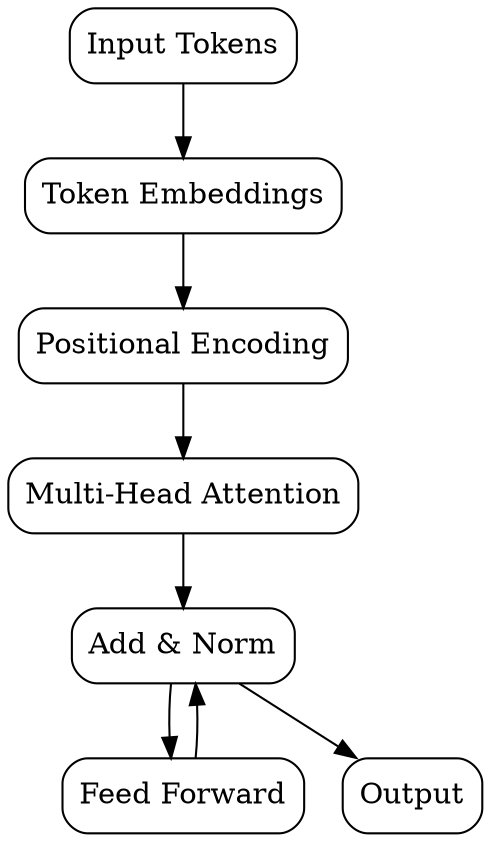

# Transformers

## The Problem
Recurrent Neural Networks (RNNs) and LSTMs processed sequences sequentially, making them slow to train and unable to capture long-range dependencies effectively. There was no parallelizable architecture for sequence modeling.

## Core Idea
Transformers use self-attention mechanisms to process all tokens in a sequence simultaneously, enabling parallel training and capturing relationships between any two tokens regardless of distance. They became the foundation of modern LLMs.

## How It Works
The Transformer architecture consists of:
1. **Self-attention** — each token attends to all other tokens, computing weighted representations
2. **Multi-head attention** — multiple attention mechanisms run in parallel for different relationship types
3. **Feed-forward networks** — process each token's representation independently
4. **Positional encoding** — adds position information since there's no recurrence

The architecture has an encoder (for understanding) and decoder (for generation). Decoder-only models (like GPT) use only the decoder stack.

## Visual Explanation

## Key Properties
- **Parallelizable** — all tokens processed simultaneously (unlike RNNs)
- **Long-range dependencies** — attention can connect any two positions directly
- **Scalable** — performance improves with more parameters and data (scaling laws)
- **Transfer learning** — pre-trained models can be fine-tuned for specific tasks

## Connections
- Built from: [[neural-networks|Neural Networks]] — Transformers are a specific neural network architecture
- Builds into: [[flux-architecture|Flux Architecture]] — uses DiT (Diffusion Transformer)
- Builds into: [[t5-encoder|T5 Encoder]] — transformer-based text encoder
- Related: [[clip|CLIP Encoder]] — uses transformer for text encoding
- Related: [[lora-finetuning|LoRA Fine-tuning]] — adapts transformer weights efficiently
- Contrasts with: [[rnn|RNN]] — sequential vs parallel processing

## Edge Cases & Gotchas
- **Quadratic complexity** — attention is O(n²) in sequence length; limits context window
- **No recurrence** — needs positional encoding to understand token order
- **Data and compute hungry** — large transformers require massive resources to train

## Sources
- [[imgen-summary|Image Generation Source Summary]]
