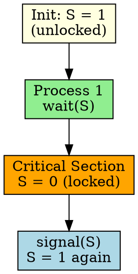

## The Problem

When only one process can access a shared resource at a time (mutual exclusion), we need a semaphore with only two states: locked and unlocked.

## Core Idea

A binary semaphore can only take values 0 (locked) and 1 (unlocked), used for mutual exclusion of critical sections.

## How It Works

1. Initialize semaphore to 1 (unlocked)
2. Process enters critical section: `wait(S)` → S becomes 0 (locked)
3. Other processes calling `wait(S)` block (S becomes negative)
4. Process exits: `signal(S)` → S becomes 1 (unlocked), wake up one waiter

## Key Properties

- Only two values: 0 (locked) and 1 (unlocked)
- Provides mutual exclusion (mutex)
- Initialized to 1 for mutex use
- Can be used as a lock/mutex

## Connections

- **Built from:** [[semaphore|Semaphore]], [[critical-section|Critical Section]]
- **Builds into:** [[mutex|Mutex]], [[race-condition|Race Condition]]
- **Related:** [[counting-semaphore|Counting Semaphore]]
- **Contrasts with:** [[counting-semaphore|Counting Semaphore]] (one bit vs N values)

## Edge Cases & Gotchas

- Busy-waiting implementation wastes CPU (better to block/sleep)
- Must be acquired and released by same process
- Forgetting signal() causes deadlock