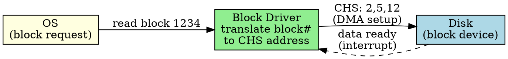

## The Problem

Block devices (disks, SSDs) transfer data in fixed-size blocks and support seeking to arbitrary positions. The OS needs a driver type that understands block addressing and buffering.

## Core Idea

A block driver handles block-oriented devices, managing block-sized data transfers (typically 512B or 4KB), supporting random access and buffering.

## How It Works

1. OS sends block read/write request (block number, count)
2. Driver translates block number to disk address (cylinder, head, sector)
3. Driver sets up DMA for bulk data transfer
4. Driver handles completion interrupt
5. Driver may do elevator sorting (disk scheduling) for multiple requests

## Key Properties

- Transfers fixed-size blocks (512B, 4KB typical)
- Supports random access (seek to any block)
- Uses buffering/caching heavily (buffers are block-sized)
- Examples: hard disk driver, SSD driver, USB mass storage

## Connections

- **Built from:** [[device-driver|Device Driver]], [[io-devices|I/O Devices]]
- **Builds into:** [[disk-structure|Disk Structure]], [[disk-scheduling|Disk Scheduling]]
- **Related:** [[character-driver|Character Driver]], [[dma|DMA]], [[buffering|Buffering]]
- **Contrasts with:** [[network-driver|Network Driver]] (packet-based, not block-based)

## Edge Cases & Gotchas

- Block size must match device's physical block size (or be properly translated)
- Misaligned block accesses hurt performance on some devices
- Some "block" devices are actually flash-backed and have different characteristics

## Sources

- [[io-summary|I/O System Source Summary]]
