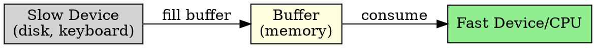
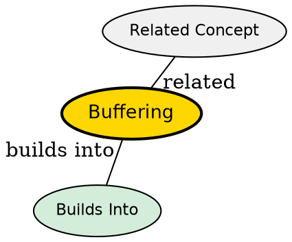

## The Problem

Devices operate at different speeds (CPU is fast, disk is slow, keyboard is very slow). Data transfer between them needs temporary storage to bridge the speed gap.

## Core Idea

Buffering is the use of temporary storage (in memory) to hold data while it's being transferred between devices or between a device and an application.

## How It Works

1. Data from slow device stored in buffer (memory)
2. Fast device/CPU can read from buffer at its own speed
3. Buffer decouples producer and consumer of data
4. Can be single buffer, double buffer, or circular buffer

## Key Properties

- Decouples speed differences between devices
- Can be single, double, or circular buffer
- Block devices use buffer cache (disk blocks)
- Character devices use line buffers or raw mode

## Semantic Network

## Connections

- **Built from:** [[io-system|I/O System]], [[device-independent-io-software|Device-Independent I/O Software]]
- **Builds into:** [[io-request-to-hardware|I/O Request to Hardware Operation]]
- **Related:** [[device-driver|Device Driver]], [[dma|DMA]]
- **Contrasts with:** [[no-buffering|No Buffering]] (unbuffered I/O is slow)

## Edge Cases & Gotchas

- Buffer overflow if consumer too slow
- Buffer too small = frequent I/O operations
- Buffer too large = wasted memory