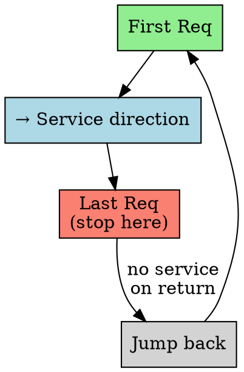
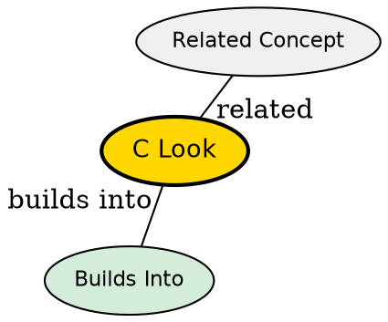

## The Problem

C-SCAN wastes time on the return jump (no service), and always goes to disk end. Can we combine C-SCAN and LOOK?

## Core Idea

C-LOOK combines C-SCAN (one direction only) with LOOK (stop at last request), giving uniform wait times without unnecessary travel.

## How It Works

1. Move in one direction, service requests
2. Stop at last request (don't go to disk end)
3. Jump back to first request
4. Continue in same direction (circular)

## Key Properties

- Uniform wait times (like C-SCAN)
- No unnecessary travel to disk end (like LOOK)
- Most efficient of the SCAN family
- Default in many modern systems

## Semantic Network

## Connections

- **Built from:** [[disk-scheduling|Disk Scheduling]], [[c-scan|C-SCAN]], [[look-scheduling|LOOK]]
- **Related:** [[scan-scheduling|SCAN]]
- **Contrasts with:** [[c-scan|C-SCAN]] (stops at last request vs goes to end)

## Edge Cases & Gotchas

- Needs to track first and last request
- Most practical for real-world workloads
- Often the default disk scheduler