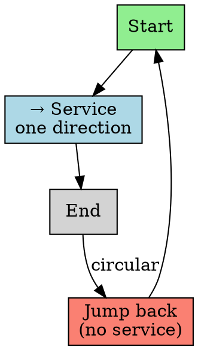
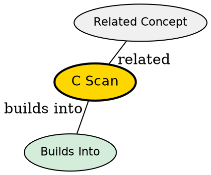

## The Problem

SCAN has uneven wait times -- requests just passed when the arm reverses have to wait a full cycle. Can we make wait times more uniform?

## Core Idea

C-SCAN (Circular SCAN) services requests in one direction only, then jumps back to the beginning without servicing requests on the return trip.

## How It Works

1. Move disk arm in one direction (e.g., inward)
2. Service all requests in that direction
3. When reaching end, jump back to start
4. Continue in same direction (no reverse)
5. Circular -- never reverses direction

## Key Properties

- More uniform wait times than SCAN
- No reversal = simpler logic
- Wastes time on return jump (no service)
- Better for systems needing predictable latency

## Semantic Network

## Connections

- **Built from:** [[disk-scheduling|Disk Scheduling]], [[scan-scheduling|SCAN]]
- **Builds into:** [[look-scheduling|LOOK]], [[c-look|C-LOOK]]
- **Related:** [[disk-structure|Disk Structure]]
- **Contrasts with:** [[scan-scheduling|SCAN]] (one direction vs reverse)

## Edge Cases & Gotchas

- Return jump wastes time (no requests serviced)
- Still may not be optimal for all workloads
- Good for real-time systems (predictable)